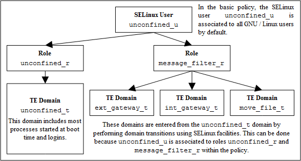

# Role-Based Access Control

To further control access to TE domains SELinux makes use of role-based
access control (RBAC). This feature allows SELinux users to be
associated to one or more roles, where each role is then associated to
one or more domain types as shown in **Figure 4: Role Based Access Control**.

The SELinux role name is the second component of a 'security context'
and by convention SELinux roles end in `_r`, however this is not
enforced by any SELinux service (i.e. it is only used to identify the
role component), although CIL with namespaces does make identification
of a role easier for example a 'role' could be declared as
`unconfined.role`.

It is possible to add constraints and bounds on roles as discussed in
the [**Type Enforcement**](type_enforcement.md#type-enforcement) section.

Some policies, for example Android, only make use of one role called `r`.

**Figure 4: Role Based Access Control** - *Showing how SELinux controls
access via user, role and domain type association.*

 

<!-- Cut Here -->

<table>
<tbody>
<td>

<a href="users.md#selinux-users" title="SELinux Users"> <strong>Previous</strong></a>

</td>
<td>

<a href=href="README.md#the-selinux-notebook" title="The SELinux Notebook"> <strong>Home</strong></a>

</td>
<td>

<a href="type_enforcement.md#type-enforcement" title="Type Enforcement (TE)"> <strong>Next</strong></a>

</td>
</tbody>
</table>

<head>
    
</head>
