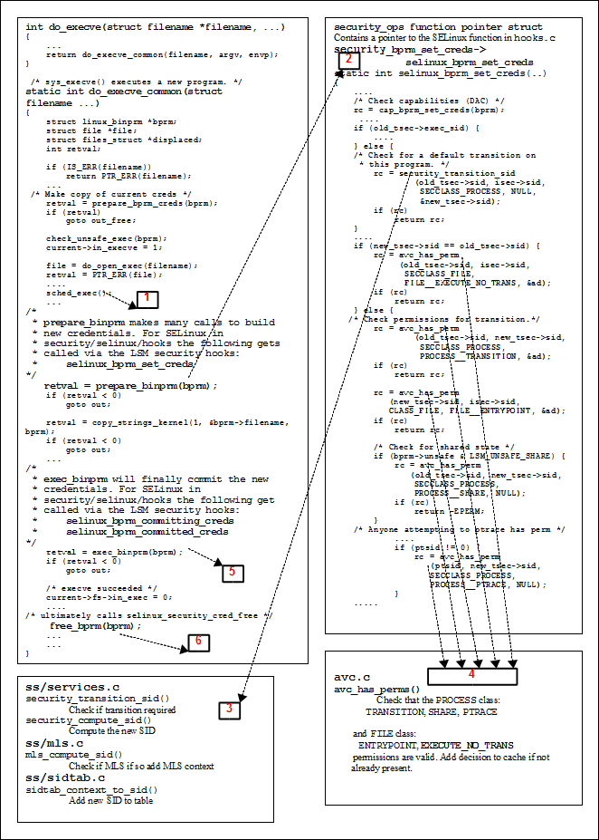

# Linux Security Module and SELinux

This section gives a high level overview of the LSM and SELinux internal
kernel structure and workings as enabled in kernel 3.14. A more detailed
view can be found in the
[**Implementing SELinux as a Linux Security Module**](https://www.nsa.gov/Portals/70/documents/resources/everyone/digital-media-center/publications/research-papers/implementing-selinux-as-linux-security-module-report.pdf)
that was used extensively to develop this section (and also using
the SELinux kernel source code). The major areas covered are:

1.  How the LSM and SELinux modules work together.
2.  The major SELinux internal services.
3.  The ***fork**(2)* and ***exec**(2)* system calls are followed through as an
    example to tie in with the transition process covered in the
    [Domain Transition](domain_object_transitions.md#domain-transition) section.
4.  The SELinux filesystem */sys/fs/selinux*.
5.  The */proc* filesystem area most applicable to SELinux.


## The LSM Module

The LSM is the Linux security framework that allows 3<sup>rd</sup> party
access control mechanisms to be linked into the GNU / Linux kernel.
There are a number of services that utilise the LSM:

1.  SELinux - the subject of this Notebook.
2.  AppArmor is a MAC service based on pathnames and does not require
    labeling or relabeling of filesystems. See
    **<(http://wiki.apparmor.net/>** for details.
3.  Simplified Mandatory Access Control Kernel (SMACK). See
    **<http://www.schaufler-ca.com/>** for details.
4.  Tomoyo that is a name based MAC and details can be found at
    **<http://sourceforge.jp/projects/tomoyo/docs>**.
5.  Yama extends the DAC support for ***ptrace**(2)*. See
    *Documentation/security/Yama.txt* for further details.
6.  Lockdown feature. If set to integrity, kernel features that allow
    userspace to modify the running kernel are disabled. If set to
    confidentiality, kernel features that allow userspace to extract
    confidential information from the kernel are disabled.

The basic idea behind LSM is to:

-   Insert security function hooks and security data structures in the
    various kernel services to allow access control to be applied over
    and above that already implemented via DAC. The type of service that
    have hooks inserted are shown in with an example task and program
    execution shown in the
    [Fork System Call Walk-thorough](#fork-system-call-walk-thorough) and
    [Process Transition Walk-thorough](#process-transition-walk-thorough)
    sections.
-   Allow registration and initialisation services for the
    3<sup>rd</sup> party security modules.
-   Allow process security attributes to be available to userspace
    services by extending the */proc* filesystem with a security
    namespace as shown in . These are located at:

```
/proc/<self|pid>/attr/<attr>
```

```
/proc/<self|pid>/task/<tid>/attr/<attr>
```

Where `<pid>` is the process id, `<tid>` is the thread id, and `<attr>` is the
entry described in **Table 2: /proc Filesystem attribute files**.

-   Support filesystems that use extended attributes (SELinux uses
    `security.selinux` as explained in the
    [**Labeling Extended Attribute Filesystems**](objects.md#labeling-extended-attribute-filesystems)
    section).
-   Later kernels (ver ?) allow 'module stacking' where the LSM modules
    can be called in a predifined order, for example:

```
lockdown,yama,loadpin,safesetid,integrity,selinux,smack,tomoyo,apparmor,bpf
```

It should be noted that the LSM does not provide any security services
itself, only the hooks and structures for supporting 3<sup>rd</sup>
party modules. If no 3<sup>rd</sup> party module is loaded, the
capabilities module becomes the default module thus allowing standard
DAC access control.

|                           |                       |                   |
| ------------------------- | --------------------- | ----------------- |
| Program execution         | Filesystem operations | Inode operations  |
| File operations           | Task operations       | Netlink messaging |
| Unix domain networking    | Socket operations     | XFRM operations   |
| Key Management operations | IPC operations        | Memory Segments   |
| Semaphores                | Capability            | Sysctl            |
| Syslog                    | Audit                 |                   |

**Table 1: LSM Hooks** - *These are the kernel services that LSM has
inserted security hooks and structures to allow access control to be
managed by 3<sup>rd</sup> party modules (see
./linux-3.14/include/linux/security.h).*


| ***/proc/self/attr/*** **Permissions** |  **File Name**|     **Function**                              |
| ------------ | ------------ | ------------------------------------------------------------------------ |
| `current`    | `-rw-rw-rw-` | Contains the current process security context.                           |
| `exec`       | `-rw-rw-rw-` | Used to set the security context for the next exec call.                 |
| `fscreate`   | `-rw-rw-rw-` | Used to set the security context of a newly created file.                |
| `keycreate`  | `-rw-rw-rw-` | Used to set the security context for keys that are cached in the kernel. |
| `prev`       | `-r--r--r--` | Contains the previous process security context.                          |
| `sockcreate` | `-rw-rw-rw-` | Used to set the security context of a newly created socket.              |

**Table 2: /proc Filesystem attribute files** - *These files are used by
the kernel services and libselinux (for userspace) to manage setting and
reading of security contexts within the LSM defined data structures.*

The major kernel source files (*./security*) that form the LSM are shown
in **Table 3:** *The core LSM source modules*. However there is one major
header file (*include/linux/security.h*) that describes all the LSM security
hooks and structures.

<table>
<tbody>
<tr style="background-color:#D3D3D3;">
<td><strong>Name</strong></td>
<td><strong>Function</strong></td>
</tr>
<tr>
<td>commoncap.c</td>
<td></td>
</tr>
<tr>
<td>device_cgroup.c</td>
<td></td>
</tr>
<tr>
<td>inode.c</td>
<td>This allows the 3<sup>rd</sup> party security module to initialise a security filesystem. In the case of SELinux this would be <em>/sys/fs/selinux</em> that is defined in the <em>selinux/selinuxfs.c</em> source file. </td>
</tr>
<tr>
<td>security.c</td>
<td>Contains the LSM framework initialisation services that will set up the hooks described in <em>security.h</em> and those in the capability source files. It also provides functions to initialise 3<sup>rd</sup> party modules. </td>
</tr>
<tr>
<td>lsm_audit.c</td>
<td>Contains common LSM audit functions.</td>
</tr>
<tr>
<td>min_addr.c</td>
<td>Minimum VM address protection from userspace for DAC and LSM.</td>
</tr>
</tbody>
</table>

**Table 3:** *The core LSM source modules.*


## The SELinux Module

This section does not go into detail of all the SELinux module
functionality as the
[**Implementing SELinux as a Linux Security Module**](https://www.nsa.gov/resources/everyone/digital-media-center/publications/research-papers/assets/files/implementing-selinux-as-linux-security-module-report.pdf)
 does this (although a bit dated).

However this section does attempt to highlight the way some areas work by
using the example described in the
[Domain and Object Transitions](domain_object_transitions.md#domain-and-object-transitions)
section. To achieve this, these will describe the:
-    [**Fork System Call Walk-thorough**](#fork-system-call-walk-thorough)
-    [**Process Transition Walk-thorough**](#process-transition-walk-thorough)

The major kernel SELinux source files (*security/selinux*) that form the
SELinux security module are shown in. The diagrams shown in and can be used
to see how some of these kernel source modules fit together.

<table>
<tbody>
<tr style="background-color:#D3D3D3;">
<td><strong>Name</strong></td>
<td><strong>Function</strong></td>
</tr>
<tr>
<td><em>avc.c</em></td>
<td>Access Vector Cache functions and structures. The function calls are for the kernel services, however they have been ported to form the <em>libselinux</em> userspace library.</td>
</tr>
<tr>
<td><em>exports.c</em></td>
<td>Exported SELinux services for SECMARK (as there is SELinux specific code in the netfilter source tree).</td>
</tr>
<tr>
<td><em>hooks.c</em></td>
<td>Contains all the SELinux functions that are called by the kernel resources via the <em>security_ops</em> function table (they form the kernel resource object managers). There are also support functions for managing process exec's, managing SID allocation and removal, interfacing into the AVC and Security Server.</td>
</tr>
<tr>
<td>netif.c</td>
<td>These manage the mapping between labels and SIDs for the <em>net</em>* language statements when they are declared in the active policy.</td>
</tr>
<tr>
<td><em>netnode.c</em></td>
<td></td>
</tr>
<tr>
<td><em>netport.c</em></td>
<td></td>
</tr>
<tr>
<td><em>netlabel.c</em></td>
<td>The interface between NetLabel services and SELinux.</td>
</tr>
<tr>
<td>netlink.c</td>
<td>Manages the notification of policy updates to resources including userspace applications via <em>libselinux</em>.</td>
</tr>
<tr>
<td>nlmsgtab.c</td>
<td></td>
</tr>
<tr>
<td><em>selinuxfs.c</em></td>
<td>The <em>selinuxfs</em> pseudo filesystem (<em>/sys/fs/selinux</em>) that imports/exports security policy information to/from userspace services. The services exported are shown in the <a href="lsm_selinux.md#selinux-filesystem">SELinux Filesystem</a> section.</td>
</tr>
<tr>
<td>xfrm.c</td>
<td>Contains the IPSec XFRM (transform) hooks for SELinux.</td>
</tr>
<tr>
<td><em>include/classmap.h</em></td>
<td><p><em>classmap.h</em> contains all the kernel security classes and permissions. <em>initial_sid_to_string.h</em> contains the initial SID contexts. These are used to build the <em>flask.h</em> and <em>av_permissions.h</em> kernel configuration files when the kernel is being built (using the <em>genheaders</em> script defined in the <em>selinux/Makefile</em>). </p>
<p>These files are built this way now to support the new dynamic security class mapping structure to remove the need for fixed class to SID mapping.</p></td>
</tr>
<tr>
<td><em>include/initial_sid_to_string.h</em></td>
<td></td>
</tr>
<tr>
<td>ss/avtab.c</td>
<td>AVC table functions for inserting / deleting entries.</td>
</tr>
<tr>
<td>ss/conditional.c</td>
<td>Support boolean statement functions and implements a conditional AV table to hold entries.</td>
</tr>
<tr>
<td>ss/ebitmap.c</td>
<td>Bitmaps to represent sets of values, such as types, roles, categories, and classes.</td>
</tr>
<tr>
<td>ss/hashtab.c</td>
<td>Hash table.</td>
</tr>
<tr>
<td>ss/mls.c</td>
<td>Functions to support MLS.</td>
</tr>
<tr>
<td>ss/policydb.c</td>
<td>Defines the structure of the policy database. See the "<a href="http://securityblog.org/brindle/2006/07/05/selinux-policy-module-primer/"><em>SELinux Policy Module Primer</em></a>" article for details on the structure.</td>
</tr>
<tr>
<td>ss/services.c</td>
<td><p>This contains the supporting services for kernel hooks defined in <em>hooks.c</em>, the AVC and the Security Server. </p>
<p>For example the <em>security_transition_sid</em> that computes the SID for a new subject / object shown in <em></em>.</p></td>
</tr>
<tr>
<td>ss/sidtab.c</td>
<td>The SID table contains the security context indexed by its SID value.</td>
</tr>
<tr>
<td>ss/status.c</td>
<td>Interface for <em>selinuxfs/status</em>. Used by the <em>libselinux</em> <em>selinux_status_*(3)</em> functions.</td>
</tr>
<tr>
<td>ss/symtab.c</td>
<td>Maintains associations between symbol strings and their values.</td>
</tr>
</tbody>
</table>

**Table 4: The core SELinux source modules** - *The .h files and those in
the include directory have a number of useful comments.*


### Fork System Call Walk-thorough

This section walks through the the ***fork**(2)* system call shown in
[**Figure 7**](domain_object_transitions.md#domain-transition) starting at the
kernel hooks that link to the SELinux services. The way the SELinux hooks are
initialised into the LSM *security_ops* function table are also described.

Using , the major steps to check whether the `unconfined_t` process has
permission to use the fork permission are:

1.  The *kernel/fork.c* has a hook that links it to the LSM function
    `security_task_create()` that is called to check access
    permissions.
2.  Because the SELinux module has been initialised as the security
    module, the `security_ops` table has been set to point to the
    SELinux `selinux_task_create()` function in *hooks.c*.
3.  The `selinux_task_create()` function check whether the task has
    permission via the `current_has_perm(current, PROCESS__FORK)`
    function.
4.  This will result in a call to the AVC via the `avc_has_perm()`
    function in *avc.c* that checks whether the permission has been
    granted or not. First (via `avc_has_perm_noaudit()`) the cache is
    checked for an entry. Assuming that there is no entry in the AVC,
    then the `security_compute_av()` function in *services.c* is
    called.
5.  The `security_compute_av()` function will search the SID table for
    source and target entries, and if found will then call the
    `context_struct_compute_av()` function.

The `context_struct_compute_av()` function carries out many checks to
validate whether access is allowed. The steps are (assuming the access
is valid):
-   Initialise the AV structure so that it is clear.
-   Check the object class and permissions are correct. It also checks
    the status of the `allow_unknown` flag (see the
    [**SELinux Filesystem**](#selinux-filesystem),
    [*/etc/selinux/semanage.conf*](global_config_files.md#etcselinuxsemanage.conf)
    and
    [Reference Policy Build Options](reference_policy.md#the-reference-policy)
    *build.conf* and `UNK_PERMS` sections.
-   Checks if there are any type enforcement rules (AVTAB_ALLOWED,
    AVTAB_AUDITALLOW, AVTAB_AUDITDENY, AVTAB_XPERMS).
-   Check whether any conditional statements are involved via the
    `cond_compute_av()` function in *conditional.c*.
-   Remove permissions that are defined in any `constraint` rule via the
    `constraint_expr_eval()` function call (in *services.c*). This
    function will also check any MLS constraints.
-   `context_struct_compute_av()` checks if a process transition is
    being requested (it is not). If it were, then the `transition` and
    `dyntransition` permissions are checked and whether the role is
    changing.
-   Finally check whether there are any constraints applied via the
    `typebounds` rule.
7.  Once the result has been computed it is returned to the
    *kernel/fork.c* system call via the initial `selinux_task_create()`
    function. In this case the ***fork**(2)* call is allowed.
8.  **The End.**


**Figure 10: Hooks for the** ***fork**(2)* **system call** *This describes the steps
required to check access permissions for Object Class `process` and
permission `fork`.*


### Process Transition Walk-thorough

This section walks through the ***execve**(2)* and checking whether a
process transition to the `ext_gateway_t` domain is allowed, and if so
obtain a new SID for the context
`unconfined_u:message_filter_r:ext_gateway_t` as shown in
[**Figure 7: Domain Transition**](domain_object_transitions.md#domain-transition).

The process starts with the Linux operating system issuing a
`do_execve` (that passes over the file name to be run and its
environment + arguments) call from the CPU specific architecture code to execute
a new program (for example, from *arch/ia64/kernel/process.c*). The
`do_execve()` function is located in the *fs/exec.c* source code module
and does the loading and final exec as described below.

`do_execve()` has a number of calls to `security_bprm_*` functions
that are a part of the LSM (see *include/linux*/*security.h*), and are
hooked by SELinux during the initialisation process (in
*security/selinux*/*hooks.c*). briefly describes these `security_bprm`
functions that are hooks for validating program loading and execution
(although see *security.h* for greater detail).

<table>
<tbody>
<tr style="background-color:#D3D3D3;">
<td><strong>LSM / SElinux Function Name</strong></td>
<td><strong>Description</strong></td>
</tr>
<tr>
<td><p><code>security_bprm_set_creds-></code></p>
<p><code>selinux_bprm_set_creds</code></p></td>
<td>Set up security information in the <code>bprm->security</code> field based on the file to be exec'ed contained in <code>bprm->file</code>. SELinux uses this hook to check for domain transitions and the whether the appropriate permissions have been granted, and obtaining a new SID if required.</td>
</tr>
<tr>
<td><p><code>security_bprm_committing_creds-></code></p>
<p><code>selinux_bprm_committing_creds</code></p></td>
<td>Prepare to install the new security attributes of the process being transformed by an execve operation. SELinux uses this hook to close any unauthorised files, clear parent signal and reset resource limits if required.</td>
</tr>
<tr>
<td><p><code>security_bprm_committed_creds-></code></p>
<p><code>selinux_bprm_ committed_creds</code></p></td>
<td>Tidy up after the installation of the new security attributes of a process being transformed by an <code>execve</code> operation. SELinux uses this hook to check whether signal states can be inherited if new SID allocated.</td>
</tr>
<tr>
<td><p><code>security_bprm_secureexec-></code></p>
<p><code>selinux_bprm_secureexec</code></p></td>
<td>Called when loading libraries to check <em>AT_SECURE</em> flag for glibc secure mode support. SELinux uses this hook to check the <em>process</em> class <em>noatsecure</em> permission if appropriate.</td>
</tr>
<tr>
<td><p><code>security_bprm_check-></code></p>
<p><code>selinux_bprm_check_security</p></td>
<td>This hook is not used by SELinux.</td>
</tr>
</tbody>
</table>

***Table 5: The LSM / SELinux Program Loading Hooks***

Therefore starting at the `do_execve()` function and using, the
following major steps will be carried out to check whether the
`unconfined_t` process has permission to transition the
*secure_server* executable to the `ext_gateway_t` domain:

1.  The executable file is opened, a call issued to the `sched_exec()`
    function and the `bprm` structure is initialised with the file
    parameters (name, environment and arguments).
2.  Via the `prepare_binprm()` function call the UID and GIDs are
    checked and a call issued to `security_bprm_set_creds()` that
    will carry out the following:
3.  Call `cap_bprm_set_creds` function in *commoncap.c*, that will
    set up credentials based on any configured capabilities.

If ***setexeccon**(3)* has been called prior to the `exec`, then that
context will be used otherwise call `security_transition_sid()`
function in *services.c*. This function will then call
`security_compute_sid()` to check whether a new SID needs to be
computed. This function will (assuming there are no errors):

-  Search the SID table for the source and target SIDs.
-  Sets the SELinux user identity.
-  Set the source role and type.
-  Checks that a `type_transition rule exists in the AV table and /
    or the conditional AV table (see **Figure 12: The Main LSM / SELinux Modules**).
-  If a `type_transition`, then also check for a `role_transition`
    (there is a role change in the *ext_gateway.conf* policy module),
    set the role.
-  Check if any MLS attributes by calling `mls_compute_sid()` in
    *mls.c*. It also checks whether MLS is enabled or not, if so sets
    up MLS contexts.
-  Check whether the contexts are valid by calling
    `compute_sid_handle_invalid_context()` that will also log an
    audit message if the context is invalid.
-  Finally obtains a SID for the new context by calling
    `sidtab_context_to_sid()` in *sidtab.c* that will search the
    SID table (see **Figure 12: The Main LSM / SELinux Modules**)
    and insert a new entry if okay or log a kernel event if invalid.
4.  The `selinux_bprm_set_creds()` function will continue by checking
    via the `avc_has_perm()` functions (in *avc.c*) whether the *file*
    class `file_execute_no_trans` is set (in this case it is not),
    therefore the `process` class `transition` and `file` class
    `entrypoint` permissions are checked (in this case they are
    allowed), therefore the new SID is set, and after checking various
    other permissions, control is passed back to the `do_execve`
    function.
5.  The `exec_binprm` function will ultimately commit the credentials
    calling the SELinux `selinux_bprm_committing_creds` and
    `selinux_bprm_committed_creds`.
6.  Various strings are copied (args etc.) and a check is made to see if
    the exec succeeded or not (in this case it did), therefore the
    `security_bprm_free()` function is ultimately called to free the
    `bprm` security structure.
7.  **The End.**



**Figure 11: Process Transition** - *This shows the major steps required to
check if a transition is allowed from the `unconfined_t` domain to the
`ext_gateway_t` domain.*


**Figure 12: The Main LSM / SELinux Modules** - *The fork and exec functions
link to [**Figure 7**](domain_object_transitions.md#domain-transition)
where the transition process is described.*


#### SELinux Filesystem

**Table 6: SELinux filesystem Information** shows the information contained
in the SELinux filesystem (*selinuxfs*) */sys/fs/selinux* where the SELinux kernel
exports information regarding its configuration and active policy.
*selinuxfs* is a read/write interface used by SELinux library functions
for userspace SELinux-aware applications and object managers. Note:
while it is possible for userspace applications to read/write to this
interface, it is not recommended - use the **libselinux** or **libsepol** library.

<table>
<tbody>
<tr style="background-color:#D3D3D3;">
<td><strong>selinuxfs Directory and File Names</strong></td>
<td><strong>Permissions</strong></td>
<td><strong>Comments</strong></td>
</tr>
<tr>
<td>/sys/fs/selinux</td>
<td>Directory</td>
<td>This is the root directory where the SELinux kernel exports relevant information regarding its configuration and active policy for use by the libselinux library.</td>
</tr>
<tr>
<td>access</td>
<td>-rw-rw-rw-</td>
<td><p>Compute access decision interface that is used by the <em><strong>security_compute_av</strong>(3)</em>,<em><strong>security_compute_av_flags</strong>(3)</em>, <em><strong>avc_has_perm</strong>(3)</em> and <em><strong>avc_has_perm_noaudit</strong>(3)</em> functions.</p>
<p>The kernel security server (see <em>services.c</em>) converts the contexts to SIDs and then calls the <em>security_compute_av_user</em> function to compute the new SID that is then converted to a context string.</p>
<p>Requires <em>security { compute_av }</em> permission.</p></td>
</tr>
<tr>
<td>checkreqprot</td>
<td>-rw-r--r--</td>
<td><p><em>0</em> = Check requested protection applied by kernel.</p>
<p><em>1</em> = Check protection requested by application. This is the default.</p>
<p>These apply to the <em>mmap</em> and <em>mprotect</em> kernel calls. Default value can be changed at boot time via the <em>checkreqprot=</em> parameter.</p>
<p>Requires <em>security { setcheckreqprot }</em> permission.</p></td>
</tr>
<tr>
<td>commit_pending_bools</td>
<td>--w-------</td>
<td><p>Commit new boolean values to the kernel policy.</p>
<p>Requires <em>security { setbool }</em> permission.</p></td>
</tr>
<tr>
<td>context</td>
<td>-rw-rw-rw-</td>
<td><p>Validate context interface used by the <em><strong>security_check_context</strong>(3)</em> function.</p>
<p>Requires <em>security { check_context }</em> permission.</p></td>
</tr>
<tr>
<td>create</td>
<td>-rw-rw-rw-</td>
<td><p>Compute create labeling decision interface that is used by the <em><strong>security_compute_create</strong>(3)</em> and <em><strong>avc_compute_create</strong>(3)</em> functions. </p>
<p>The kernel security server (see <em>services.c</em>) converts the contexts to SIDs and then calls the <em>security_transition_sid_user</em> function to compute the new SID that is then converted to a context string.</p>
<p>Requires <em>security { compute_create }</em> permission.</p></td>
</tr>
<tr>
<td>deny_unknown<p>reject_unknown</p></td>
<td>-r--r--r--</td>
<td><p>These two files export <em>deny_unknown,</em> (read by <em><strong>security_deny_unknown</strong>(3)</em> function) and reject_unknown status to user space. </p>
<p>These are taken from the <em>handle-unknown</em> parameter set in the <a href="global_config_files.md#etcselinuxsemanage.conf">/etc/selinux/semanage.conf</a> when policy is being built and are set as follows:</p>
<p>deny:reject</p>
<p>   0:0 = Allow unknown object class / permissions. This will set the returned AV with all 1's.</p>
<p>       1:0 = Deny unknown object class / permissions (the default). This will set the returned AV with all 0's.</p>
<p>   1:1 = Reject loading the policy if it does not contain all the object classes / permissions.</p></td>
</tr>
<tr>
<td>disable</td>
<td>--w-------</td>
<td>Disable SELinux until next reboot.</td>
</tr>
<tr>
<td>enforce</td>
<td>-rw-r--r--</td>
<td><p>Get or set enforcing status.</p>
<p>Requires <em>security { setenforce }</em> permission.</p></td>
</tr>
<tr>
<td>load</td>
<td>-rw-------</td>
<td><p>Load policy interface.</p>
<p>Requires <em>security { load_policy }</em> permission.</p></td>
</tr>
<tr>
<td>member</td>
<td>-rw-rw-rw-</td>
<td><p>Compute polyinstantiation membership decision interface that is used by the <em><strong>security_compute_member</strong>(3)</em> and <em><strong>avc_compute_member</strong>(3)</em> functions. </p>
<p>The kernel security server (see <em>services.c</em>) converts the contexts to SIDs and then calls the <em>security_member_sid</em> function to compute the new SID that is then converted to a context string.</p>
<p>Requires <em>security { compute_member }</em> permission.</p></td>
</tr>
<tr>
<td>mls</td>
<td>-r--r--r--</td>
<td>Returns 1 if MLS policy is enabled or 0 if not.</td>
</tr>
<tr>
<td>null</td>
<td>crw-rw-rw-</td>
<td>The SELinux equivalent of <em>/dev/null</em> for file descriptors that have been redirected by SELinux.</td>
</tr>
<tr>
<td>policy</td>
<td>-r--r--r--</td>
<td>Interface to upload the current running policy in kernel binary format. This is useful to check the running policy using <em><strong>apol</strong>(1)</em> , <em>dispol</em>/<em>sedispol</em> etc. (e.g. <em>cat /sys/fs/selinux/policy &gt; current-policy</em> then load it into the required tool).</td>
</tr>
<tr>
<td>policyvers</td>
<td>-r--r--r--</td>
<td>Returns supported policy version for kernel. Read by <em><strong>security_policyvers</strong>(3)</em> function.</td>
</tr>
<tr>
<td>relabel</td>
<td>-rw-rw-rw-</td>
<td><p>Compute relabeling decision interface that is used by the <em><strong>security_compute_relabel</strong>(3)</em> function. </p>
<p>The kernel security server (see <em>services.c</em>) converts the contexts to SIDs and then calls the <em>security_change_sid</em> function to compute the new SID that is then converted to a context string.</p>
<p>Requires <em>security { compute_relabel }</em> permission.</p></td>
</tr>
<tr>
<td>status</td>
<td>-r--r--r--</td>
<td><p>This can be used to obtain enforcing mode and policy load changes with much less over-head than using the <em>libselinux</em> netlink / call backs. This was added for Object Managers that have high volumes of AVC requests so they can quickly check whether to invalidate their cache or not.</p>
<p>The status structure indicates the following:</p>
<p><em>version</em> - Version number of the status structure. This will increase as other entries are added.</p>
<p><em>sequence</em> - This is incremented for each event with an even number meaning that the events are stable. An odd number indicates that one of the events is changing and therefore the userspace application should wait before reading the status of any event.</p>
<p><em>enforcing</em> - <em>0</em> = Permissive mode, <em>1</em> = enforcing mode.</p>
<p><em>policyload</em> - This contains the policy load sequence number and should be read and stored, then compared to detect a policy reload.</p>
<p><em>deny_unknown</em> - <em>0</em> = Allow and <em>1</em> = Deny unknown object classes / permissions. This is the same as the <em>deny_unknown</em> entry above.</p></td>
</tr>
<tr>
<td>user</td>
<td>-rw-rw-rw-</td>
<td><p>Compute reachable user contexts interface that is used by the <em><strong>security_compute_user</strong>(3)</em> function. </p>
<p>The kernel security server (see <em>services.c</em>) converts the contexts to SIDs and then calls the <em>security_get_user_sids</em> function to compute the user SIDs that are then converted to context strings.</p>
<p>Requires <em>security { compute_user }</em> permission.</p></td>
</tr>
<tr>
<td>validatetrans</td>
<td>--w--w--w</td>
<td><p>Compute <em>validatetrans</em> decision interface. </p>
<p>Requires <em>security { validate_trans }</em> permission. Used by the <em><strong>security_validatetrans</strong>(3)</em> function</p></td>
</tr>
<tr>
<td>/sys/fs/selinux/avc</td>
<td>Directory</td>
<td>This directory contains information regarding the kernel AVC that can be displayed by the avcstat command.</td>
</tr>
<tr>
<td>cache_stats</td>
<td>-r--r--r--</td>
<td>Shows the kernel AVC lookups, hits, misses etc.</td>
</tr>
<tr>
<td>cache_threshold</td>
<td>-rw-r--r--</td>
<td><p>The default value is 512, however caching can be turned off (but performance suffers) by:</p>
<p>echo 0 &gt; /selinux/avc/cache_threshold</p>
<p>Requires <em>security {setsecparam}</em> permission.</p></td>
</tr>
<tr>
<td>hash_stats</td>
<td>-r--r--r--</td>
<td>Shows the number of kernel AVC entries, longest chain etc.</td>
</tr>
<tr>
<td>/sys/fs/selinux/booleans</td>
<td>Directory</td>
<td>This directory contains one file for each boolean defined in the active policy.</td>
</tr>
<tr>
<td><p>secmark_audit</p>
<p>......</p>
<p>......</p></td>
<td>-rw-r--r--</td>
<td>Each file contains the current and pending status of the boolean (0 = false or 1 = true). The <strong>getsebool</strong>(8), <strong>setsebool</strong>(8) and <strong>sestatus</strong>(8)<strong> -b</strong> commands use this interface via the <em>libselinux</em> library functions.</td>
</tr>
<tr>
<td>/sys/fs/selinux/initial_contexts</td>
<td>Directory</td>
<td>This directory contains one file for each initial SID defined in the active policy. The file name is the initial SID name with the contents containing its security context.</td>
</tr>
<tr>
<td><p>any_socket</p>
<p>devnull</p>
<p>.....</p></td>
<td>-r--r--r--</td>
<td>Each file contains the initial context of the initial SID as defined in the active policy (e.g. any_socket was assigned system_u:object_r:unconfined_t).</td>
</tr>
<tr>
<td>/sys/fs/selinux/policy_capabilities</td>
<td>Directory</td>
<td>This directory contains the policy capabilities that have been configured by default in the kernel via the <em><em>policycap</em><em> statement</em></em> in the active policy. Their default values are false.</td>
</tr>
<tr>
<td>always_check_network</td>
<td>-r--r--r--</td>
<td>If true SECMARK and NetLabel peer labeling are always enabled even if there are no SECMARK, NetLabel or Labeled IPsec rules configured. This forces checking of the <em>packet</em> class to protect the system should any rules fail to load or they get maliciously flushed. Requires kernel 3.13 minimum.</td>
</tr>
<tr>
<td>cgroup_seclabel</td>
<td>-r--r--r--</td>
<td>Allows userspace to set labels on cgroup/cgroup2 files, enabling fine-grained labeling of cgroup files by userspace. Supported by Linux v4.11 or later.</td>
</tr>
<tr>
<td>extended_socket_class</td>
<td>-r--r--r--</td>
<td>Enables the use of separate socket security classes for all network address families rather than the generic socket class.</td>
</tr>
<tr>
<td>genfs_seclabel_symlinks</td>
<td>-r--r--r--</td>
<td>Enables fine-grained labeling of symlinks in pseudo filesystems based on genfscon rules.</td>
</tr>
<tr>
<td>network_peer_controls</td>
<td>-r--r--r--</td>
<td><p>If true the following network_peer_controls are enabled:</p>
<p>node: sendto recvfrom</p>
<p>netif: ingress egress</p>
<p>peer: recv</p></td>
</tr>
<tr>
<td>nnp_nosuid_transition</td>
<td>-r--r--r--</td>
<td>Enables SELinux domain transitions to occur under <em>no_new_privs</em> (NNP) or on <em>nosuid</em> mounts if the corresponding permission (<em>nnp_transition</em> for NNP, <em>nosuid_transition</em> for <em>nosuid</em>, defined in the <em>process2</em> security class) is allowed between the old and new contexts.</td>
</tr>
<tr>
<td>open_perms</td>
<td>-r--r--r--</td>
<td>If true the open permissions are enabled by default on the following object classes: dir, file, fifo_file, chr_file, blk_file.</td>
</tr>
<tr>
<td>/sys/fs/selinux/class</td>
<td>Directory</td>
<td>This directory contains a list of classes and their permissions as defined by the policy (for the Reference Policy the order in the <em>security_classes</em> and <em>access_vectors</em> files).</td>
</tr>
<tr>
<td>/sys/fs/selinux/class/appletalk_socket</td>
<td>Directory</td>
<td>Each class has its own directory where each one is named using the appropriate class statement from the policy (i.e. <em>class appletalk_socket</em>). Each directory contains the following: </td>
</tr>
<tr>
<td>index</td>
<td>-r--r--r--</td>
<td>This file contains the allocated class number (e.g. appletalk_socket is the 56<sup>th</sup> entry in the policy <em>security_classes</em> file).</td>
</tr>
<tr>
<td>/sys/fs/selinux/class/appletalk_socket/perms</td>
<td>Directory</td>
<td>This directory contains one file for each permission defined in the policy.</td>
</tr>
<tr>
<td><p>accept</p>
<p>append</p>
<p>bind</p>
<p>....</p></td>
<td>-r--r--r--</td>
<td>Each file is named by the permission assigned in the policy and contains a number that represents its position in the list (e.g. <em>accept</em> is the 15<sup>th</sup> permission listed in the policy <em>access_vector</em> file for the <em>appletalk_socket</em> and therefore contains '15'.</td>
</tr>
</tbody>
</table>

**Table 6: SELinux filesystem Information**

Notes:

1.  Kernel SIDs are not passed to userspace only the context strings.
2.  The */proc* filesystem exports the process security context string
    to userspace via */proc/&lt;self|pid&gt;/attr* and
    */proc/&lt;self|pid&gt;/task/&lt;tid&gt;/attr/&lt;attr&gt;*
    interfaces.


<!-- %CUTHERE% -->

---
**[[ PREV ]](pam_login.md)** **[[ TOP ]](#)** **[[ NEXT ]](userspace_libraries.md)**
