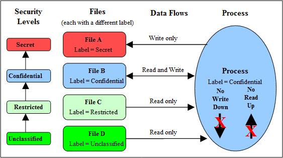

# Multi-Level and Multi-Category Security

- [MLS or MCS Policy](#mls-or-mcs-policy)
- [Security Levels](#security-levels)
  - [MLS / MCS Range Format](#mls-mcs-range-format)
  - [Translating Levels](#translating-levels)
  - [Managing Security Levels via Dominance Rules](#managing-security-levels-via-dominance-rules)
- [MLS Labeled Network and Database Support](#mls-labeled-network-and-database-support)
- [Common Criteria Certification](#common-criteria-certification)

As stated in the
[**Mandatory Access Control (MAC)**](mac.md#mandatory-access-control)
section as well as supporting Type Enforcement (TE), SELinux also supports
MLS and MCS by adding an optional *level* or *range* entry to the security
context. This section gives a brief introduction to MLS and MCS.

**Figure 8: Security Levels and Data Flows** shows a simple diagram where
security levels represent the classification of files within a file server.
The security levels are strictly hierarchical and conform to the
[*Bell-La & Padula model*](http://en.wikipedia.org/wiki/Bell-LaPadula_model)
(BLP) in that (in the case of SELinux) a process (running at the
'Confidential' level) can read / write at their current level but only read
down levels or write up levels (the assumption here is that the process is
authorised).

This ensures confidentiality as the process can copy a file up to the
secret level, but can never re-read that content unless the process
'steps up to that level', also the process cannot write files to the
lower levels as confidential information would then drift downwards.



**Figure 8: Security Levels and Data Flows** - *This shows how the process
can only 'Read Down' and 'Write Up' within an MLS enabled system.*

To achieve this level of control, the MLS extensions to SELinux make use
of constraints similar to those described in the type enforcement
[**Type Enforcement - Constraints**](type_enforcement.md#constraints) section,
except that the statement is called *mlsconstrain*.

However, as always life is not so simple as:

1. Processes and objects can be given a range that represents the low
   and high security levels.
2. The security level can be more complex, in that it is a hierarchical
   sensitivity and zero or more non-hierarchical categories.
3. Allowing a process access to an object is managed by 'dominance'
   rules applied to the security levels.
4. Trusted processes can be given privileges that will allow them to
   bypass the BLP rules and basically do anything (that the security
   policy allowed of course).
5. Some objects do not support separate read / write functions as they
   need to read / respond in cases such as networks.

The sections that follow discuss the format of a security level and
range, and how these are managed by the constraints mechanism within
SELinux using dominance rules.

## MLS or MCS Policy

SELinux only knows of MLS, i.e. it has a MLS engine in the security
server[^fn_mls_1] and a MLS portion of the policy configuration that drives
that engine. The MLS engine has been leveraged by two different types of
policy:

- The MLS configuration modeled after Bell-LaPadula.
- The MCS configuration that allows a process or object to be labeled with
  categories. This has proved useful as a transparent isolation mechanism
  for sandbox, container, and virtualization runtimes (see the
  [**Virtual Machine Support**](vm_support.md#selinux-virtual-machine-support)
  section).

As a security level is a combination of a hierarchical sensitivity and a
non-hierarchical (potentially empty) category set, MCS doesn't employ
sensitivities since there is no hierarchical relationship to be enforced.
Note however, that the SELinux kernel policy language defines *sensitivity*
as a single value such as *s0*, *s1* etc.. Therefore the BLP defined
sensitivity is formed in an SELinux MLS policy by a combination of the
following (excluding the category statements):

```
sensitivity s0;
sensitivity s1;
dominance { s0 s1 } # s1 dominates s0
```

While an MCS policy does not use the BLP sensitivity definition, an SELinux
policy still requires the following entries (basically defining a single level):

```
sensitivity s0;
dominance { s0 }
```

The number of sensitivities, number of categories, and the set of MLS
constraints used to determine whether a permission is allowed are entirely up
to the policy author. See the
[**The Reference Policy**](reference_policy.md#the-reference-policy) section
for its configuration parameters.

## Security Levels

The optional MLS policy extension adds an additional security context
component that consists of the following highlighted entries:

*user:role:type* ***:sensitivity[:category,...] - sensitivity[:category,...]***

Note that:

- Security Levels on objects are called Classifications.
- Security Levels on subjects are called Clearances.

The list below describes the components that make up a security level and how
two security levels form a range for an MLS
[**Security Context**](security_context.md#security-context):

- **Low**
  - *sensitivity[:category, ... ]*
    - For a process or subject this is the current level or sensitivity.
      For an object this is the current level or sensitivity.
- **SystemLow**
  - This is the lowest level or classification for the system (for SELinux this
    is generally *s0*, note that there are no categories).
- **High**
  - *sensitivity[:category, ... ]*
    - For a process or subject this is the Clearance. For an object this is
      the maximum range.
- **SystemHigh**
  - This is the highest level or classification for the system (for an MLS
    Reference Policy the default is *s15:c0,c255*, although this is a
    configurable build option).

The format used in the policy language statements is fully described in
the [MLS Statements](mls_statements.md#mls-statements) section, however
a brief overview follows.

### MLS / MCS Range Format

The components are used to define the MLS security levels and MCS categories
within the security context are:

```
user:role:type:sensitivity[:category,...]  -  sensitivity [:category,...]
---------------▼------------------------▼-----▼-------------------------▼
               |        level           |  -  |          level          |
               |                         range                          |
```

**Where:**

*sensitivity*

- Sensitivity levels are hierarchical with (traditionally) *s0* being the
  lowest. These values are defined using the *sensitivity* statement.
  To define their hierarchy, the *dominance* statement is used.
- For MLS systems the highest sensitivity is the last one defined in the
  *dominance* statement (low to high). Traditionally the maximum for MLS systems
  is *s15* (although the maximum value for the *Reference Policy* is a build
  time option).
- For MCS systems there is only one *sensitivity* statement defined, and that
  is *s0*.

*category*

- Categories are optional (i.e. there can be zero or more categories) and they
  form unordered and unrelated lists of 'compartments'. These values are
  defined using the *category* statement, where for example *c0.c3*
  represents the range that consists of *c0 c1 c2 c3* and *c0, c3, c7* that
  represents an unordered list. Traditionally the values are between*c0* and
  *c255* (although the maximum value for the Reference Policy is a build time
  option).

*level*

- The level is a combination of the *sensitivity* and *category* values that
  form the actual security level. These values are defined using the *level*
  statement.

Example policy entries:

```
# MLS Policy statements:
sensitivity s0;
sensitivity s1;
dominance { s0 s1 }
category c0;
category c1;
level s0:c0.c1;
level s1:c0.c1;
```

```
# MCS Policy statements:
sensitivity s0;
dominance { s0 }
category c0;
category c1;
level s0:c0.c1;
```

### Translating Levels

When writing policy for MLS / MCS security level components it is usual
to use an abbreviated form such as *s0*, *s1* etc. to represent
sensitivities and *c0*, *c1* etc. to represent categories. This is done
simply to conserve space as they are held on files as extended
attributes and also in memory. So that these labels can be represented
in human readable form, a translation service is provided via the
[**setrans.conf**](policy_config_files.md#setrans.conf) configuration file that
is used by the ***mcstransd**(8)* daemon. For example *s0* = Unclassified, *s15*
= Top Secret and *c0* = Finance, *c100* = Spy Stories. The ***semanage**(8)*
command can be used to set up this translation and is shown in the
[**setrans.conf**](policy_config_files.md#setrans.conf) configuration file
section.

### Managing Security Levels via Dominance Rules

As stated earlier, allowing a process access to an object is managed by
[***dominance***](mls_statements.md#dominance) rules applied to the security
levels. These rules are as follows:

**Security Level 1 dominates Security Level 2**

 - If the sensitivity of *Security Level 1* is equal to or higher than the
   sensitivity of *Security Level 2* and the categories of *Security Level 1*
   are the same or a superset of the categories of *Security Level 2*.

**Security Level 1 is dominated by Security Level 2**

 - If the sensitivity of *Security Level 1* is equal to or lower than the
   sensitivity of *Security Level 2* and the categories of *Security Level 1*
   are a subset of the categories of *Security Level 2*.

**Security Level 1 equals Security Level 2**

 - If the sensitivity of *Security Level 1* is equal to *Security Level 2*
   and the categories of *Security Level 1* and *Security Level 2* are the
   same set (sometimes expressed as: both Security Levels dominate each other).

**Security Level 1 is incomparable to Security Level 2**

 - If the categories of *Security Level 1* and *Security Level 2* cannot be
   compared (i.e. neither Security Level dominates the other).

To illustrate the usage of these rules, **Table 1: MLS Security Levels** lists
the security level attributes in a table to show example files (or
documents) that have been allocated labels such as *s3:c0*. The process
that accesses these files (e.g. an editor) is running with a range of
*s0 - s3:c1.c5* and has access to the files highlighted within the grey box
area.

As the MLS *dominance* statement is used to enforce the
sensitivity hierarchy, the security levels now follow that sequence
(lowest = *s0* to highest = *s3*) with the categories being unordered lists
of 'compartments'. To allow the process access to files within its scope
and within the dominance rules, the process will be constrained by using
the *mlsconstrain* statement as illustrated in
**Figure 9: *mlsconstrain* Statements controlling Read Down & Write Up**.

| Security Level |  Sensitivity   |       |           |           |           |           |           |       |     |
| :------------- | :------------: | :---: | :-------: | :-------: | :-------: | :-------: | :-------: | :---: | :-: |
|                |**Category -\>**| *c0*  |    *c1*   |    *c2*   |    *c3*   |    *c4*   |    *c5*   | *c6*  |*c7* |
|**Secret**      |*s3*            |*s3:c0*|           |           |           |           |***s3:c5***|*s3:c6*|     |
|**Confidential**|*s2*            |       |***s2:c1***|***s2:c2***|***s2:c3***|***s2:c4***|           |       |s2:c7|
|**Restricted**  |*s1*            |*s1:c0*|***s1:c1***|           |           |           |           |       |s1:c7|
|**Unclassified**|*s0*            |*s0:c0*|           |           |***s0:c3***|           |           |       |s0:c7|

**Table 1: MLS Security Levels** - *Showing that a process running at
s0 - s3:c1.c5 has access to the highlighted **sensitivity:category** files*.


**Figure 9: Showing mlsconstrain Statements controlling Read Down & Write Up** -
*This ties in with* **Table 1: MLS Security Levels** *that shows a process
running with a security range of s0 - s3:c1.c5.*

Using **Figure 9: *mlsconstrain* Statements controlling Read Down & Write Up**:

- To allow write-up, the source level (*l1*) must be **dominated by**
  the target level (*l2*):
  - Source level = *s0:c3* or *s1:c1*
  - Target level = *s2:c1.c4*

As can be seen, either of the source levels are **dominated by** the
target level.

- To allow read-down, the source level (*l1*) must **dominate** the
  target level (*l2*):
  - Source level = *s2:c1.c4*
  - Target level = *s0:c3*

As can be seen, the source level does **dominate** the target level.

However in the real world the SELinux MLS Reference Policy does not
allow the write-up unless the process has a special privilege (by having
the domain type added to an attribute), although it does allow the
read-down. The default is to use *l1 eq l2* (i.e. the levels are equal).
The reference policy MLS source file (policy/mls) shows these
*mlsconstrain* statements.

## MLS Labeled Network and Database Support

Networking for MLS is supported via the NetLabel CIPSO (commercial IP
security option) and CALIPSO (Common Architecture Label
IPv6 Security Option) services as discussed in the
[**SELinux Networking Support**](network_support.md#selinux-networking-support)
section.

PostgreSQL supports labeling for MLS database services as discussed in
the [**SE-PostgreSQL Support**](postgresql.md#postgresql-selinux-support)
section.

## Common Criteria Certification

While the [*Common Criteria*](http://www.commoncriteriaportal.org/)
certification process is beyond the scope of this Notebook, it is worth
highlighting that specific Red Hat GNU / Linux versions of software,
running on specific hardware platforms with SELinux / MLS policy
enabled, have passed the Common Criteria evaluation process. Note, for
the evaluation (and deployment) the software and hardware are tied
together, therefore whenever an update is carried out, an updated
certificate should be obtained.

The Red Hat evaluation process cover the:

- Labeled Security Protection Profile
  ([*LSPP*](http://www.commoncriteriaportal.org/files/ppfiles/lspp.pdf)) -
  This describes how systems that implement security labels (i.e. MLS) should
  function.
- Controlled Access Protection Profile
  ([*CAPP*](http://www.commoncriteriaportal.org/files/ppfiles/capp.pdf)) -
  This describes how systems that implement DAC should function.

An interesting point:

- Both Red Hat Linux 5.1 and Microsoft Server 2003 (with XP) have both
  been certified to EAL4+ , however while the evaluation levels may be
  the same the Protection Profiles that they were evaluated under
  were: Microsoft CAPP only, Red Hat CAPP and LSPP. Therefore always
  look at the protection profiles as they define what was actually
  evaluated.

[^fn_mls_1]:  See [**Figure 2: High Level SELinux Architecture**](core_components.md#core-selinux-components)
in the 'Core SELinux Components' section.

<!-- %CUTHERE% -->

---
**[[ PREV ]](domain_object_transitions.md)** **[[ TOP ]](#)** **[[ NEXT ]](types_of_policy.md)**
