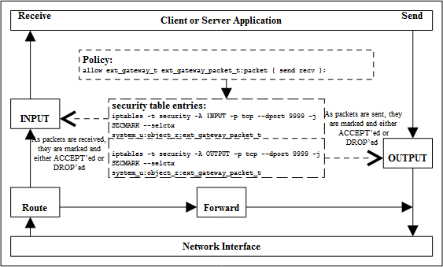
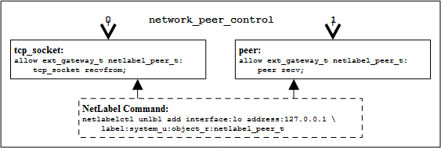
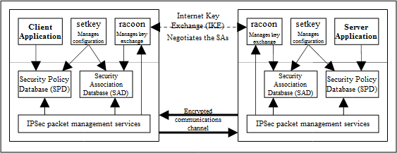

# SELinux Networking Support

SELinux supports the following types of network labeling:

**Internal labeling** - This is where network objects are labeled and
managed internally within a single machine (i.e. their labels are not
transmitted as part of the session with remote systems). There are two
types supported: SECMARK and NetLabel. There was a service known as
'compat_net' controls, however that was removed in kernel 2.6.30.

**Labeled Networking** - This is where labels are passed to/from remote
systems where they can be interpreted and a MAC policy enforced on each
system. There are three types supported: Labeled IPSec, CIPSO
(Commercial IP Security Option) and CALIPSO (Common Architecture Label
IPv6 Security Option)

There are two policy capability options that can be set within policy
using the `policycap` statement that affect networking configuration:

**`network_peer_controls`** - This is always enabled in the latest
Reference Policy source. **Figure 14: Fallback Labeling** shows the difference
between the policy capability being set to 0 and 1.

**`always_check_network`** - This capability would normally be
set to false. If true SECMARK and NetLabel peer labeling are always
enabled even if there are no SECMARK, NetLabel or Labeled IPsec rules
configured. This forces checking of the `packet` class to protect the
system should any rules fail to load or they get maliciously flushed.
Requires kernel 3.13 minimum.

**`extended_socket_class`** - Enable separate security classes for all
network address families previously mapped to the `socket` class and for
ICMP and SCTP sockets previously mapped to the `rawip_socket` class.
Requires kernel 4.11+.

The policy capability settings are available in userspace via the
SELinux filesystem as shown in the
[**SELinux Filesystem**](lsm_selinux.md#selinux-filesystem) section.

To support peer labeling, CIPSO and CALIPSO the NetLabel tools need to
be installed:

```
dnf install netlabel_tools
```

To support Labeled IPSec the IPSec tools need to be installed:

```
dnf install ipsec-tools
```

It is also possible to use an alternative Labeled IPSec service that was
OpenSwan but is now distributed as LibreSwan:

```
dnf install libreswan
```

It is important to note that the kernel must be configured to support
these services. The Fedora kernels are configured to handle all the above
services.

The Linux networking package *iproute* has an SELinux aware socket
statistics command ***ss**(8)* that will show the SELinux context of
network processes (`-Z` or `--context` option) and network sockets (`-z`
or `--contexts` option). Note that the socket contexts are taken from
the inode associated to the socket and not from the actual kernel socket
structure (as currently there is no standard kernel/userspace interface
to achieve this).


## SECMARK

SECMARK makes use of the standard kernel NetFilter framework that
underpins the GNU / Linux IP networking sub-system. NetFilter services
automatically inspects all incoming and outgoing packets and can place
controls on interfaces, IP addresses (nodes) and ports with the added
advantage of connection tracking. The SECMARK security extensions allow
security contexts to be added to packets (SECMARK) or sessions
(CONNSECMARK).

The NetFilter framework inspects and tag packets with labels as defined
within ***iptables**(8)* (also 'nftables' ***nft**(8)* from version 9.3 with
kernel 4.20) and then uses the security framework (e.g. SELinux) to
enforce the policy rules. Therefore SECMARK services are not SELinux
specific as other security modules using the LSM infrastructure could
also implement the same services (e.g. SMACK).

While the implementation of iptables / NetFilter is beyond the scope of
this Notebook, there are tutorials available. The
*selinux-testsuite inet_socket* and *sctp* tests have examples of
*iptables* and *nftables* using SECMARK, some of which are shown below.

**Figure 13: SECMARK Processing** shows the basic structure with the process
working as follows:

-   A table called the `security table` is used to define the parameters
    that identify and 'mark' packets that can then be tracked as the
    packet travels through the networking sub-system. These 'marks' are
    called SECMARK and CONNSECMARK.
-   A SECMARK is placed against a packet if it matches an entry in the
    security table applying a label that can then be used to enforce
    policy on the packet.
-   The CONNSECMARK 'marks' all packets within a
    session<a href="#fnn1" class="footnote-ref" id="fnnet1"><strong><sup>1</sup></strong></a>
    with the appropriate label that can then be used to enforce policy.



**Figure 13: SECMARK Processing** - *Received packets are processed by the
INPUT chain where labels are added to the appropriate packets that will either
be accepted or dropped by the SECMARK process. Packets being sent are treated
the same way.*

Example iptables and nftables entries are shown below. Note that the
tables will not load correctly if the policy does not allow the
ip/nftables domain to relabel the security table entries unless permissive
mode is enabled (i.e. the tables must have the relabel permission for each
entry in the table).

 An ipv4 `security table` *iptables* entry is as follows:

```
# Flush the security table.
iptables -t security -F

# Create a chain for new connection marking.
iptables -t security -N NEWCONN

# Accept incoming connections, label SYN packets, and copy labels to connections.
iptables -t security -A INPUT -i lo -p tcp --dport 65535 -m state --state NEW -j NEWCONN
iptables -t security -A NEWCONN -j SECMARK --selctx system_u:object_r:test_server_packet_t:s0
iptables -t security -A NEWCONN -j CONNSECMARK --save
iptables -t security -A NEWCONN -j ACCEPT

# Common rules which copy connection labels to established and related packets.
iptables -t security -A INPUT -m state --state ESTABLISHED,RELATED -j CONNSECMARK --restore
iptables -t security -A OUTPUT -m state --state ESTABLISHED,RELATED -j CONNSECMARK --restore

# Label UDP packets similarly.
iptables -t security -A INPUT -i lo -p udp --dport 65535 -j SECMARK --selctx system_u:object_r:test_server_packet_t:s0
iptables -t security -A OUTPUT -o lo -p udp --sport 65535 -j SECMARK --selctx system_u:object_r:test_server_packet_t:s0
```

The equivalent *nftable* entry for an ipv6 `security table` is as follows:

```
add table ip6 security

table ip6 security {
    secmark inet_server {
        "system_u:object_r:test_server_packet_t:s0"
    }
    map secmapping_in_out {
        type inet_service : secmark
        elements = { 65535 : "inet_server" }
    }
    chain input {
        type filter hook input priority 0;

        ct state new meta secmark set tcp dport map @secmapping_in_out
        ct state new meta secmark set udp dport map @secmapping_in_out
        ct state new ct secmark set meta secmark

        ct state established,related meta secmark set ct secmark
    }
    chain output {
        type filter hook output priority 0;

        ct state new meta secmark set tcp dport map @secmapping_in_out
        ct state established meta secmark set udp dport map @secmapping_in_out
        ct state new ct secmark set meta secmark

        ct state established,related meta secmark set ct secmark
    }
}
```

The following articles explain the SECMARK service:
-   [*Transitioning to Secmark*](http://paulmoore.livejournal.com/4281.html)
-   [New secmark-based network controls for SELinux](http://james-morris.livejournal.com/11010.html)


## NetLabel - Fallback Peer Labeling

Fallback labeling can optionally be implemented on a system if the
Labeled IPSec or CIPSO/CALIPSO is not being used (hence 'fallback
labeling'). If either Labeled IPSec or CIPSO/CALIPSO are being used,
then these take priority. There is an article
"[Fallback Label Configuration Example](http://paulmoore.livejournal.com/1758.html)"
that explains their usage, the ***netlabelctl**(8)* man page is
also a useful reference.

The network peer controls have been extended to support an additional
object class of `peer` that is enabled by default in the Fedora policy as
the `network_peer_controls` in */sys/fs/selinux/policy_capabilities* is
set to '*1*'. **Figure 14: Fallback Labeling** shows the differences between
the policy capability `network_peer_controls` being set to 0 and 1.



**Figure 14: Fallback Labeling** - *Showing the differences between the
policy capability **`network_peer_controls`** set to 0 and 1.*


The *selinux-testsuite inet_socket* and *sctp* tests have examples of
fallback labeling, and the following are a set of ***netlabelctl**(8)*
commands from the *sctp* test:

```
netlabelctl map del default
netlabelctl map add default address:0.0.0.0/0 protocol:unlbl
netlabelctl map add default address:::/0 protocol:unlbl
netlabelctl unlbl add interface:lo address:127.0.0.0/8 label:system_u:object_r:netlabel_sctp_peer_t:s0
netlabelctl unlbl add interface:lo address:::1/128 label:system_u:object_r:deny_assoc_sctp_peer_t:s0
# Display Netlabel configuration:
netlabelctl -p map list
```
Note that the security contexts must be valid in the policy otherwise the
commands will fail.


## NetLabel – CIPSO/CALIPSO

To allow MLS [**security levels**](mls_mcs.md#security-levels) to be passed
over a network between MLS
systems<a href="#fnn2" class="footnote-ref" id="fnnet2"><strong><sup>2</sup></strong></a>,
the Commercial IP Security Option (CIPSO) protocol is used. This is defined in the
[**CIPSO Internet Draft**](http://tools.ietf.org/html/draft-ietf-cipso-ipsecurity-01)
document (this is an obsolete document, however the protocol is still in
use). The protocol defines how security levels are encoded in the IP
packet header for IPv4.

The Common Architecture Label IPv6 Security Option (CALIPSO) protocol
described in [**rfc 5570**](http://ietf.org/rfc/rfc5570.txt) is supported in
kernels from 4.8.

CIPSO/CALIPSO will only pass the MLS component of the security context
over the network, however in loopback mode CIPSO allows the full
security context to be passed as explained in the
"**Full SELinux Labels Over Loopback with NetLabel and CIPSO**" available at
<http://paulmoore.livejournal.com/7234.html>.

The protocol is configured by the NetLabel service
***netlabelctl**(8)* and can be used by other security modules that use
the LSM infrastructure. The implementation supports:

1.  A non-translation option (Tag Type 1 '**bit mapped**') where labels are
    passed to / from systems unchanged (for host to host communications as
    show in **Figure 15**).
-   Note that CALIPSO only supports this option, and an example
    ***netlabelctl**(8)* command setting a DOI of 16 is:
```
netlabelctl calipso add pass doi:16
```


**Figure 15:** - *MLS Systems on the same network*

2.  Allow a maximum of 256 sensitivity levels and 240 categories to be mapped
    (Tag Type 2 '**enumerated**').

3.  A translation option (Tag Type 5 '**range**') where both the sensitivity
    and category components can be mapped for systems that have either different
    definitions for labels or information can be exchanged over different
    networks (for example using an SELinux enabled gateway as a guard as
    shown in **Figure 16**. An example ***netlabelctl**(8)* command setting
    a DOI of 8 is: `netlabelctl cipsov4 add pass doi:8 tags:5`


**Figure 16:** - *MLS Systems on different networks communicating via a gateway*

There are CIPSO/CALIPSO examples in the
[***notebook-examples/network/netlabel***](notebook-examples/network/README.md)
section. The CALIPSO example ***netlabelctl**(8)* commands for loopback are:

```
netlabelctl calipso add pass doi:12345678
netlabelctl map del default
netlabelctl map add default address:0.0.0.0/0 protocol:unlbl
netlabelctl map add default address:::/0 protocol:unlbl
netlabelctl map add default address:::1 protocol:calipso,12345678
# Display Netlabel configuration:
netlabelctl -p map list
```

The examples use the *nb_client*/*nb_server* from the Notebook examples
section, plus the standard Fedora 'targeted' policy for the tests.


## Labeled IPSec

Labeled IPSec has been built into the standard GNU / Linux IPSec
services as described in the
"[**Leveraging IPSec for Distributed Authorization**](https://www.academia.edu/27514886/Leveraging_IPsec_for_Distributed_Authorization)".

**Figure 17: IPSec communications** shows the basic components that form
the service based on IPSec tools where it is generally used to set up
either an encrypted tunnel between two machines (a virtual private network
(VPN)) or an encrypted transport session. The extensions defined in the
**Leveraging IPSec for Distributed Authorization** document
describe how the security context is configured and negotiated between the two
systems (called security associations (SAs) in IPSec terminology).



**Figure 17: IPSec communications** - *The SPD contains information
regarding the security contexts to be used. These are exchanged between the
two systems as part of the channel set-up.*

Basically what happens is as follows:

1.  The security policy database (SPD) defines the security
    communications characteristics to be used between the two systems.
    This is populated using the **setkey**(8) or ***ip-xfrm**(8)* commands.
2.  The SAs have their configuration parameters such as protocols used
    for securing packets, encryption algorithms and how long the keys
    are valid held in the Security Association database (SAD). For
    Labeled IPSec the security context (or labels) is also defined
    within the SAD. SAs can be negotiated between the two systems using
    either racoon or
    pluto<a href="#fnn3" class="footnote-ref" id="fnnet3"><strong><sup>3</sup></strong></a>
    that will automatically populate the SAD or manually by the setkey utility
    (see the example below).
3.  Once the SAs have been negotiated and agreed, the link should be
    active.

A point to note is that SAs are one way only, therefore when two systems
are communicating (using the above example), one system will have an SA,
SAout for processing outbound packets and another SA, SAin, for
processing the inbound packets. The other system will also create two
SAs for processing its packets.

Each SA will share the same cryptographic parameters such as keys and
protocol (e.g. ESP (encapsulated security payload) and AH
(authentication header)).

The object class used for the association of an SA is association and
the permissions available are as follows:

<table>
<tbody>
<tr>
<td><code>polmatch</code></td>
<td>Match the SPD context (-ctx) entry to an SELinux domain (that is contained in the SAD -ctx entry)</td>
</tr>
<tr>
<td><code>recvfrom</code></td>
<td>Receive from an IPSec association.</td>
</tr>
<tr>
<td><code>sendto</code></td>
<td>Send to an IPSec association.</td>
</tr>
<tr>
<td><code>setcontext</code></td>
<td>Set the context of an IPSec association on creation (e.g. when running setkey the process will require this permission to set the context in the SAD and SPD, also racoon / <em>pluto</em> will need this permission to build the SAD).</td>
</tr>
</tbody>
</table>

When running Labeled IPSec it is recommended that the systems use the
same type/version of policy to avoid any problems with them having
different meanings.

There are two possible labeled IPSec solutions available on Fedora:

-   IPSec Tools - This uses the ***setkey**(8)* tools and ***racoon**(8)*
Internet Key Exchange (IKE) daemon.

-   LibreSwan - This uses ***ipsec**(8)* tools and ***pluto**(8)* Internet
Key Exchange (IKE) daemon. Note that the Fedora build uses the kernel
**netkey** services as Libreswan can be built to support other types.

Both work in much the same way but use different configuration files.

If interoperating between pluto and racoon, note that the DOI Security
Context type identifier has never been defined in any standard. Pluto is
configurable and defaults to '*32001*', this is the IPSEC Security
Association Attribute identifier reserved for private use. Racoon is
hard coded to a value of '*10*', therefore the pluto ***ipsec.conf**(5)*
file must be configured as follows:

```
config setup
        secctx-attr-type=10
```

The Fedora version of racoon has added functionality to support
loopback, however pluto does not. The default for Fedora is that ipsec
is disabled for loopback, however the following commands will enable
racoon to work in loopback until a re-boot:

```
echo 0 > /proc/sys/net/ipv4/conf/lo/disable_xfrm
echo 0 > /proc/sys/net/ipv4/conf/lo/disable_policy
```

By default Fedora does not enable IPSEC via its default firewall configuration,
therefore the server side requires the following command:

```
firewall-cmd --add-service ipsec
```

There are two simple examples in the
[***notebook-examples/network/ipsec***](notebook-examples/network/README.md)
section. These use ***setkey**(8)* and  commands directly
and therefore do not require the IKE daemons.

The ***ip-xfrm**(8)* example:

```
echo 0 > /proc/sys/net/ipv4/conf/lo/disable_xfrm
echo 0 > /proc/sys/net/ipv4/conf/lo/disable_policy
ip xfrm policy flush
ip xfrm state flush

ip xfrm state add src 127.0.0.1 dst 127.0.0.1 proto ah spi 0x200 ctx "unconfined_u:unconfined_r:unconfined_t:s0-s0:c0.c1023" auth sha1 0123456789012345
ip xfrm policy add src 127.0.0.1 dst 127.0.0.1 proto tcp dir out ctx "system_u:object_r:ipsec_spd_t:s0" tmpl proto ah mode transport level required

ip xfrm policy show
ip xfrm state show

```

The examples use the *nb_client*/*nb_server* from the Notebook examples
section, plus the standard Fedora 'targeted' policy for the tests.

There is a further example in the **Secure Networking with SELinux**
<http://securityblog.org/brindle/2007/05/28/secure-networking-with-selinux>
article and a good reference covering **Basic Labeled IPsec Configuration**
available at:
<http://www.redhat.com/archives/redhat-lspp/2006-November/msg00051.html>


## Labeled Network FileSystem (NFS)

Version 4.2 of NFS supports labeling between client/server and requires
the ***exports**(5)* / ***exportfs**(8)* '*security_label*' option to
be set:

```
exportfs -o rw,no_root_squash,security_label localhost:$MOUNT
```

Labeled NFS requires kernel 3.14 and the following package installed:

```
dnf install nfs-utils
```

Labeled NFS clients must use a consistent security policy.

The *selinux-testsuite tools/nfs.sh* tests labeled NFS using various labels.


<section class="footnotes">
<ol>
<li id="fnn1"><p>For example, an ftp session where the server is listening on a specific port (the destination port) but the client will be assigned a random source port. The CONNSECMARK will ensure that all packets for the ftp session are marked with the same label.<a href="#fnnet1" class="footnote-back">↩</a></p></li>
<li id="fnn2"><p>Note only the security levels are passed over the network as the other components of the security context are not part of standard MLS systems (as it may be that the remote end is a Trusted Solaris system).<a href="#fnnet2" class="footnote-back">↩</a></p></li>
<li id="fnn3"><p>These are the Internet Key Exchange (IKE) daemons that exchange encryption keys securely and also supports Labeled IPSec parameter exchanges.<a href="#fnnet3" class="footnote-back">↩</a></p></li>
</ol>
</section>


<!-- %CUTHERE% -->

---
**[[ PREV ]](userspace_libraries.md)** **[[ TOP ]](#)** **[[ NEXT ]](vm_support.md)**
