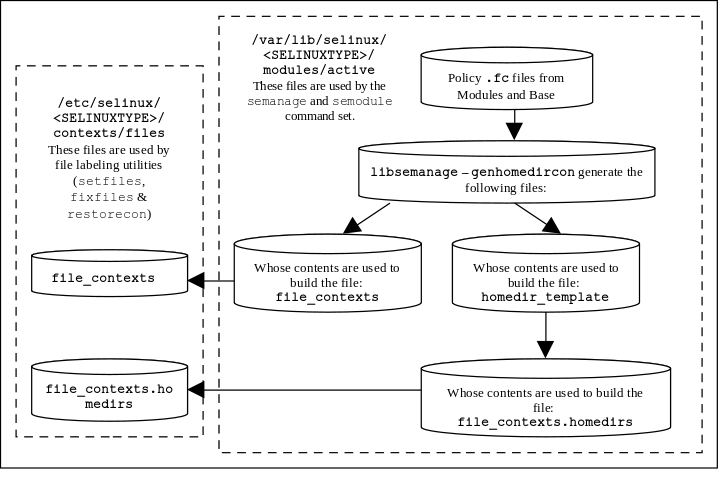

# Policy Store Configuration Files

**NOTE: Files in this area are private and subject to change, they should only
be modified using the** ***semodule**(8)* and ***semanage**(8)* commands.

Depending on the SELinux userspace library release being used the default
policy stores will be located at:

-   */etc/selinux/&lt;SELINUXTYPE&gt;/modules* - This is the default for
    systems that support versions &lt; 2.4 of the SELinux userspace library.
    The migration process to &gt;= 2.4 is described at
    <https://github.com/SELinuxProject/selinux/wiki/Policy-Store-Migration>.
-   */var/lib/selinux* - This is the default base for systems that
    support versions &gt;= 2.4 of the SELinux userspace library. This base
    may be overridden by the ***store-root*** parameter defined in the
    [***semanage.conf**(5)*](global_config_files.md#etcselinuxsemanage.conf)
    file. Multiple policy stores are supported by appending the
    *&lt;SELINUXTYPE&gt;*, for example:
-   */var/lib/selinux/mls*
-   */var/lib/selinux/targeted*

The Policy Store files are either installed, updated or built by the
***semodule**(8)* and ***semanage**(8)* commands as a part of the build
process with the resulting files being copied over to the
[**The Policy Store**](configuration_files.md#the-policy-store) area.

The policy configuration files are described relative to the default
***store-root*** at */var/lib/selinux* with *&lt;SELINUXTYPE&gt;* being
*targeted*.

The ***semanage**(8)* command must be used to configure policy (the actual
policy and supporting configuration files) within a specific **Policy Store**.
The command types are:
-   [***semanage boolean***](#activebooleans.local) Manage booleans to
    selectively enable functionality
-   [***semanage dontaudit***](#disable_dontaudit) Disable/Enable *dontaudit*
    rules in policy
-   ***semanage export*** Output local customizations
-   [***semanage fcontext***](#activefile_contexts.local) Manage file context
    mapping definitions
-   ***semanage ibendport*** Manage infiniband end port type definitions
-   ***semanage ibpkey*** Manage infiniband pkey type definitions
-   ***semanage import*** Import local customizations
-   [***semanage interface***](#activeinterfaces.local) Manage network interface
    type definitions
-   [***semanage login***](#activeseusers.local) Manage login mappings between
    linux users and SELinux confined users
-   [***semanage module***](#activemodules-directory-contents) Manage SELinux
    policy modules
-   [***semanage node***](#activenodes.local) Manage network node type definitions
-   [***semanage permissive***](#set-domain-permissive-mode) Manage process
    type enforcement mode.
-   [***semanage port***](#activeports.local) Manage network port type definitions
-   [***semanage user***](#activeusers.local) Manage  SELinux confined users
(Roles and levels for an SELinux user)


## active/modules Directory Contents

Under this directory are the respective priority directories containing
the compiled modules, plus a '*disabled*' directory listing any disabled
modules. For an overview of these 'priority options, see the
[**SELinux Configuration Files - The priority Option**](configuration_files.md#the-priority-option)
section.

The modules within the policy store may be compressed or not depending
on the value of the *bzip-blocksize* parameter in the
[***semanage.conf**(5)*](global_config_files.md#etcselinuxsemanage.conf) file.
The modules and their status can be listed using the ***semanage module -l***
command as shown below.

```
semanage module -l

Module Name               Priority  Language
abrt                      100       pp
accountsd                 100       pp
...
telnet                    100       pp
test_mlsconstrain         400       cil   Disabled
test_overlay_defaultrange 400       cil
test_policy               400       pp
...
```


### *tmp* Policy Store (build failure)

When adding/updating a policy module and it fails to  build for some reason,
the *tmp* directory (*/var/lib/selinux&lt;SELINUXTYPE&gt;/tmp*) will contain
a copy of the failed policy for inspection. An example ***semodule*** failure
message indicating the failing line number is:

```
Failed to resolve mlsconstrain statement at /var/lib/selinux/targeted/tmp/modules/400/test_mlsconstrain/cil:1
```


## *active/commit_num*

This is a binary file used by ***semanage*** for managing updates to the
store. The format is not relevant to policy construction.


### *active/policy.kern*

This is the binary policy file built by either the ***semanage**(8)* or
***semodule**(8)* commands (depending on the configuration action), that
is then becomes the
*/etc/selinux/&lt;SELINUXTYPE&gt;/policy/policy.&lt;ver&gt;* binary policy
that will be loaded into the kernel.


## *active/policy.linked*
## *active/seusers.linked*
## *active/seusers_extra.linked*

These are saved policy files prior to merging local changes to improve
performance.


## *active/booleans.local*

This file is created and updated by the ***semanage boolean*** command and
holds boolean values. The booleans must already be present in the policy, as
this command effectively turns them on and off, reloading policy (activating
the new value) if requested.

**Example** ***semanage boolean*** **command to modify a boolean value:**

```
semanage boolean -m --on daemons_enable_cluster_mode
```

**The resulting** *booleans.local* **file will be:**

```
# This file is auto-generated by libsemanage
# Do not edit directly.

daemons_enable_cluster_mode=1
```


## *disable_dontaudit*

This file is only present when the ***semodule**(8)* '-D' flag is used to
to build the policy or ***semanage dontaudit***. It indicates that a policy
has been built without the *dontaudit* rules. This allows utilities
such as ***audit2allow**(8)* to list all denials to assist debugging policy.


## *active/file_contexts*

This file becomes the policy
[*/etc/selinux/&lt;SELINUXTYPE&gt;/contexts/files/file_contexts*](policy_config_files.md#contextsfilesfile_contexts)
 file. It is built as described in the
[**Building the File Labeling Support Files**](#building-the-file-labeling-support-files)
section.

**Example** *file_contexts* **content entries:**

```
# active/file_contexts - These sample entries have
# been taken from the targeted policy.
# The keywords HOME_DIR, HOME_ROOT, USER and ROLE have been
# removed and placed in the homedir_template file.

/.* system_u:object_r:default_t:s0
/[^/]+ -- system_u:object_r:etc_runtime_t:s0
/a?quota.(user|group) -- system_u:object_r:quota_db_t:s0
/nsr(/.*)? system_u:object_r:var_t:s0
/sys(/.*)? system_u:object_r:sysfs_t:s0
/xen(/.*)? system_u:object_r:xen_image_t:s0
/mnt(/[^/]*) -l system_u:object_r:mnt_t:s0
/mnt(/[^/]*)? -d system_u:object_r:mnt_t:s0
/bin/.* system_u:object_r:bin_t:s0
/dev/.* system_u:object_r:device_t:s0
/usr/.* system_u:object_r:usr_t:s0
/var/.* system_u:object_r:var_t:s0
/run/.* system_u:object_r:var_run_t:s0
/srv/.* system_u:object_r:var_t:s0
/tmp/.* <<none>>
```

```
# ./contexts/files/file_contexts - Sample entries from the
# MLS reference policy.
# Notes:
# 1) The fixed_disk_device_t is labeled SystemHigh (s15:c0.c255)
# as it needs to be trusted. Also some logs and configuration
# files are labeled SystemHigh as they contain sensitive
# information used by trusted applications.
#
# 2) Some directories (e.g. /tmp) are labeled
# SystemLow-SystemHigh (s0-s15:c0.c255) as they will
# support polyinstantiated directories.

/.*system_u:object_r:default_t:s0
/a?quota.(user|group) --system_u:object_r:quota_db_t:s0
/mnt(/[^/]*) -lsystem_u:object_r:mnt_t:s0
/mnt/[^/]*/.*<<none>>
/dev/.*mouse.* -csystem_u:object_r:mouse_device_t:s0
/dev/.*tty[^/]* -csystem_u:object_r:tty_device_t:s0
/dev/[shmx]d[^/]*-bsystem_u:object_r:fixed_disk_device_t:s15:c0.c255
/var/[xgk]dm(/.*)?system_u:object_r:xserver_log_t:s0
/dev/(raw/)?rawctl-csystem_u:object_r:fixed_disk_device_t:s15:c0.c255
/tmp -dsystem_u:object_r:tmp_t:s0-s15:c0.c255
/dev/pts -dsystem_u:object_r:devpts_t:s0-s15:c0.c255
/var/log -dsystem_u:object_r:var_log_t:s0-s15:c0.c255
/var/tmp -dsystem_u:object_r:tmp_t:s0-s15:c0.c255
/var/run -dsystem_u:object_r:var_run_t:s0-s15:c0.c255
/usr/tmp -dsystem_u:object_r:tmp_t:s0-s15:c0.c255
```

### Building the File Labeling Support Files

The process used to build the *file_contexts* and the *file_contexts.template*
files is shown in **Figure 25: File Context Configuration Files**.

1.  They are built by ***semanage**(8)*  using entries from the 'Policy File
    Labeling' statements extracted from the
    [*active/modules*](#activemodules-directory-contents) entries
    (the *&lt;module_name&gt;.fc* files, this will include any CIL *(filecon ....)*
    statements that are within CIL policy files).
2.  As a part of the ***semanage**(8)* build process, these two files
    will also have *file_contexts.bin* and *file_contexts.homedirs.bin*
    files present in the
    [Policy Configuration Files](policy_config_files.md#contextsfilesfile_contexts)
    *./contexts/files* directory. This is because ***semanage**(8)* requires
    these in the Perl compatible regular expression (PCRE) internal format.
    They are generated by the ***sefcontext_compile**(8)* utility.



**Figure 25: File Context Configuration Files** - *The two files copied to
the policy area will be used by the file labeling utilities to relabel
files.*

**The format of these files is:**

```
pathname_regexp [file_type] security_context | <<none>>
```

**Where:**

<table>
<tbody>
<tr>
<td><code>pathname_regexp</code></td>
<td><p>An entry that defines the pathname that may be in the form of a regular expression.</p>
<p>The metacharacters '^' (match beginning of line) and '$' (match end of line) are automatically added to the expression by the routines that process this file, however they can be over-ridden by using '.*' at either the beginning or end of the expression (see the example <em>file_contexts</em> files below). </p>
<p>The source policy <em>*.fc</em> and f<em>ile_contexts.template</em> files may also contain the keywords HOME_ROOT, HOME_DIR, ROLE and USER that will be replaced as explained in the next table.</p></td>
</tr>
<tr>
<td><code>file_type</code></td>
<td><p>One of the following optional file_type entries (note if blank means "all file types"):</p>
<p>'<em>-b</em>' - Block Device         '<em>-c</em>' - Character Device</p>
<p>'<em>-d</em>' - Directory               '<em>-p</em>' - Named Pipe (FIFO)</p>
<p>'<em>-l</em>' - Symbolic Link      '<em>-s</em>' - Socket File</p>
<p>'<em>--</em>' - Ordinary file</p>
<p>By convention this entry is known as 'file type', however it really represents the 'file object class'.</p></td>
</tr>
<tr>
<td><code>security_context</code></td>
<td>This entry can be either:
<p>a. The security context, including the MLS / MCS level or range if applicable that will be assigned to the file.</p>
<p>b. A value of &lt;&lt;none&gt;&gt; can be used to indicate that matching files should not be re-labeled.</p></td>
</tr>
</tbody>
</table>


Keywords that can be in policy source \*.fc files and then form the *file_contexts.template* file entries are:

<table>
<tbody>
<tr>
<td>HOME_ROOT</td>
<td>This keyword is replaced by the Linux users root home directory, normally <em>/home</em> is the default.</td>
</tr>
<tr>
<td>HOME_DIR</td>
<td>This keyword is replaced by the Linux users home directory, normally <em>/home/</em> is the default.</td>
</tr>
<tr>
<td>USER</td>
<td>This keyword will be replaced by the users Linux user id.</td>
</tr>
<tr>
<td>ROLE</td>
<td><p>This keyword is replaced by the <code>prefix</code> entry from the users_extra configuration file that corresponds to the SELinux users user id. Example users_extra configuration file entries are:</p>
<p><code>user user_u  prefix user;</code></p>
<p><code>user staff_u prefix staff;</code></p>
<p>It is used for files and directories within the users home directory area. </p>
<p>The prefix can be added by the semanage <em>login</em> command as follows (although note that the <em>-P</em> option is suppressed when help is displayed as it is generally it is not used (defaults to <em>user</em>:</p>
<p># Add a Linux user:</p>
<p><code>adduser rch</code></p>
<p># Modify staff_u SELinux user and prefix:</p>
<p><code>semanage user -m -R staff_r -P staff staff_u</code></p>
<p># Associate the SELinux user to the Linux user:</p>
<p><code>semanage login -a -s staff_u rch</code></p></td>
</tr>
</tbody>
</table>


**Example policy source file from Reference Policy** *policy/modules/system/userdomain.fc*:

```
HOME_DIR	-d	gen_context(system_u:object_r:user_home_dir_t,s0-mls_systemhigh)
HOME_DIR	-l	gen_context(system_u:object_r:user_home_dir_t,s0-mls_systemhigh)
HOME_DIR/.+		gen_context(system_u:object_r:user_home_t,s0)
/tmp/gconfd-USER -d	gen_context(system_u:object_r:user_tmp_t,s0)
/root(/.*)?	 	gen_context(system_u:object_r:admin_home_t,s0)
/root/\.cert(/.*)?	gen_context(system_u:object_r:home_cert_t,s0)
/root/\.pki(/.*)?	gen_context(system_u:object_r:home_cert_t,s0)
/root/\.debug(/.*)?	<<none>>
```

**Example policy source file from Reference Policy** *policy/modules/kernel/files.fc*:

```
#
# HOME_ROOT
# expanded by genhomedircon
#
HOME_ROOT		-d	gen_context(system_u:object_r:home_root_t,s0-mls_systemhigh)
HOME_ROOT/home-inst		-d	gen_context(system_u:object_r:home_root_t,s0-mls_systemhigh)
HOME_ROOT/\-inst		-d	gen_context(system_u:object_r:home_root_t,s0-mls_systemhigh)
HOME_ROOT		-l	gen_context(system_u:object_r:home_root_t,s0)
HOME_ROOT/\.journal		<<none>>
HOME_ROOT/lost\+found	-d	gen_context(system_u:object_r:lost_found_t,mls_systemhigh)
HOME_ROOT/lost\+found/.*	<<none>>

# HOME_ROOT is where user HOME dirs reside as per /etc/default/useradd, but
# there may be a compat symlink from /home to HOME_ROOT. We want to make sure
# that symlink itself is always labeled home_root_t so that e.g. systemd can
# getattr as it follows it.
/home		-l	gen_context(system_u:object_r:home_root_t,s0)
```


## *active/file_contexts.local*

This file is created and updated by the ***semanage fcontext*** command. It is
used to hold file context information on files and directories that were
not delivered by the core policy (i.e. they are not defined in any of
the *\*.fc* files delivered in the base and loadable modules).

The ***semanage*** command will add the information to the *file_contexts.local*
file and then copy this file to the ./contexts/files/file_contexts.local file,
where it will be used when the file context utilities are run.

The format of the *file_contexts.local* file is the same as the
[*modules/active/file_contexts*](#activefile_contexts) file.

Example ***semanage fcontext*** command to add a new entry:

```
semanage fcontext -a -t unlabeled_t /usr/move_file
```

The resulting *file_contexts.local* file will be:

```
# This file is auto-generated by libsemanage
# Do not edit directly.

/usr/move_file    system_u:object_r:unlabeled_t:s0
```


## *active/homedir_template*

This file is built as described in the
[**Building the File Labeling Support Files**](#building-the-file-labeling-support-files)
section and is used to build the *active/file_contexts.homedirs* file.

**Example file contents:**

```
# ./active/homedir_template - These sample entries have
# been taken from the targeted policy and show the
# HOME_DIR, HOME_ROOT and USER keywords that are used to manage
# users home directories:

/tmp/gconfd-USER/.*	--	system_u:object_r:gconf_tmp_t:s0
/tmp/gconfd-USER	-d	system_u:object_r:user_tmp_t:s0
...
HOME_ROOT/home-inst	-d	system_u:object_r:home_root_t:s0
...
HOME_ROOT/\.journal	<<none>>
...
HOME_DIR/.+	system_u:object_r:user_home_t:s0
```


### *active/file_contexts.homedirs*

This file becomes the policy
[*/etc/selinux/<SELINUXTYPE>/contexts/files/file_contexts.homedirs*](policy_config_files.md#contextsfilesfile_contexts.homedirs) file. It is built
as described in the
[**Building the File Labeling Support Files**](#building-the-file-labeling-support-files)
section. It is then used by the file labeling utilities to ensure that users
home directory areas are labeled according to the policy.

The file can be built by the ***genhomedircon**(8)* command (that just calls
*/usr/sbin/semodule -Bn*) or if using ***semanage*** with user or login options
to manage users, where it is called automatically as it is now a
libsepol library function.

**Example** *file_contexts.homedirs* **contents:**

```
# ./active/file_contexts.homedirs - These sample entries have
# been taken from the targeted policy and show how the
# HOME_DIR, HOME_ROOT and USER keywords have been transformed as they
# follow the entries from the ./active/homedir_template sample above:

/tmp/gconfd-[^/]+/.*	--	unconfined_u:object_r:gconf_tmp_t:s0
/tmp/gconfd-[^/]+	-d	unconfined_u:object_r:user_tmp_t:s0
...
/home/home-inst	-d	system_u:object_r:home_root_t:s0
...
/home/\.journal	<<none>>
...
#
# Home Context for user user_u
#
/home/[^/]+/.+	unconfined_u:object_r:user_home_t:s0
```


## active/seusers
## active/seusers.local

The *active/seusers* file becomes the policy */etc/selinux/<SELINUXTYPE>/seusers*
file, the *active/seusers.local* file holds entries added when adding users via
***semanage**(8)*.

The *seusers* file is built or modified when:

1.  Building a policy where an optional *seusers* file has been included
    in the base package via the ***semodule_package**(8)* command
    (signified by the *-s* flag) as follows:
-   *semodule_package -o base.pp -m base.mod -s seusers ...*
-   The *seusers* file would be extracted by the subsequent ***semodule*** command
    when building the policy to produce the *seusers.final* file.
2.  The ***semanage login*** command is used to map Linux users to
    SELinux users as follows:
-   *semanage login -a -s staff_u rch*
-   This action will update the *seusers* file that would then be used to
    produce the seusers.final file with both policy and locally defined user
    mapping.
3.  It is also possible to associate a Linux group of users to an
    SELinux user as follows:
-   *semanage login -a -s staff_u %staff_group*

**The format of the** *seusers* & *seusers.local* **files are as follows:**

```
[%]user_id:seuser_id[:range]
```

**Where:**

<table>
<tbody>
<tr>
<td>user_id</td>
<td>Where <em>user_id</em> is the Linux user identity. If this is a Linux <em>group_id</em> then it will be preceded with the '<em>%</em>' sign as shown in the example below.</td>
</tr>
<tr>
<td>seuser_id</td>
<td>The SELinux user identity.</td>
</tr>
<tr>
<td>range</td>
<td>The optional <em>level</em> or range.</td>
</tr>
</tbody>
</table>

**Example** *seusers* **file contents:**

```
# active/modules/seusers
root:unconfined_u:s0-s0:c0.c1023
__default__:unconfined_u:s0-s0:c0.c1023
```

now use ***semanage login*** command to add a Linux user:

```
semanage login -a -s user_u rch
```

the resulting *seusers.local* file will be:

```
# This file is auto-generated by libsemanage
# Do not edit directly.

rch:user_u:s0
```

and the resulting *seusers* file will be:

```
# This file is auto-generated by libsemanage
# Do not edit directly.

root:unconfined_u:s0-s0:c0.c1023
__default__:unconfined_u:s0-s0:c0.c1023
rch:user_u:s0
```


## *active/users_extra*
## *active/users_extra.local*
## *active/users.local*

These three files work together to describe SELinux user information as
follows:

1.  The *users_extra* and *users_extra.local* files are used to map a
    *prefix* to a users home directories as discussed in the
    [**Building the File Labeling Support Files**](#building-the-file-labeling-support-files)
    section, where it is used to replace the *ROLE* keyword. The
    *prefix* is linked to an SELinux user id and should reflect the users role.
-   The *users_extra* file contains all the policy *prefix* entries, and the
    *users_extra.local* file contains those generated by the ***semanage user***
    command.
-   The *users_extra* file can optionally be included in the base package via
    the ***semodule_package**(8)* command (signified by the *-u* flag) as
    follows:
-   *semodule_package -o base.pp -m base.mod -u users_extra ...*
-   The *users_extra* file would then be extracted by a subsequent semodule
    command when building the policy.
2.  The *users.local* file is used to add new SELinux users to the policy
    without editing the policy source itself (with each line in the file
    following a policy language
    [**user Statement**](user_statements.md#user-statements)).
    This is useful when only the Reference Policy headers are installed and
    additional users need to be added. The ***semanage user*** command will allow
    a new SELinux user to be added that would generate the *user.local* file
    and if a *-P* flag has been specified, then a *users_extra.local* file is also
    updated (note: if this is a new SELinux user and a prefix is not specified
    a default *prefix* of user is generated).

**The format of the** *users_extra* & *users_extra.local* **files are:**

```
user seuser_id prefix prefix_id;
```

**Where:**

<table>
<tbody>
<tr>
<td>user</td>
<td>The user keyword.</td>
</tr>
<tr>
<td>seuser_id</td>
<td>The SELinux user identity.</td>
</tr>
<tr>
<td>prefix</td>
<td>The prefix keyword.</td>
</tr>
<tr>
<td>prefix_id</td>
<td>An identifier that will be used to replace the ROLE keyword within the active/homedir_template file when building the active/file_contexts.homedirs file for the relabeling utilities to set the security context on users home directories.</td>
</tr>
</tbody>
</table>


**Example** *users_extra* **file contents:**

```
user user_u prefix user;
user staff_u prefix user;
user sysadm_u prefix user;
user root prefix user;
```

**Example** ***semanage user*** **command to add a new SELinux user:**

```
semanage user -a -R staff_r -P staff test_u
```

the resulting *users_extra.local* file is as follows:

```
# This file is auto-generated by libsemanage
# Do not edit directly.

user test_u prefix staff;
```

and the resulting *users_extra* file will be:

```
# This file is auto-generated by libsemanage
# Do not edit directly.

user user_u prefix user;
user staff_u prefix user;
user sysadm_u prefix user;
user root prefix user;
user test_u prefix staff;
```

and the resulting *users.local* file will be:

```
# This file is auto-generated by libsemanage
# Do not edit directly.

user test_u roles { staff_r } level s0 range s0;
```


## *active/interfaces.local*

This file is created and updated by the ***semanage interface*** command to
hold network interface information that was not delivered by the core
policy. The new interface information is then built into the policy.

Each line of the file contains a *netifcon* statement that is defined
in the [***netifcon***](network_statements.md#netifcon) section.

**Example** ***semanage interface*** **command:**

```
semanage interface -a -t netif_t -r s0:c20.c250 enp7s0
```

**The resulting** *interfaces.local* **file will be:**

```
# This file is auto-generated by libsemanage
# Do not edit directly.

netifcon enp7s0 system_u:object_r:netif_t:s0:c20.c250 system_u:object_r:netif_t:s0:c20.c250
```


## *active/nodes.local*

This file is created and updated by the ***semanage node*** command to hold
network address information that was not delivered by the core policy. The
new node information is then built into policy.

Each line of the file contains a *nodecon* statement that is defined along
with examples in the policy language
[***nodecon***](network_statements.md#nodecon) section.

**Example** ***semanage node*** **command:**

```
semanage node -a -M 255.255.255.255 -t node_t -r s0:c20.c250 -p ipv4 127.0.0.2
```

**The resulting** *nodes.local* **file will be:**

```
# This file is auto-generated by libsemanage
# Do not edit directly.

nodecon ipv4 127.0.0.2 255.255.255.255 system_u:object_r:node_t:s0:c20.c250
```


## *active/ports.local*

This file is created and updated by the ***semanage port*** command to hold
network port information that was not delivered by the core policy. The new
port information is then built into the policy.

Each line of the file contains a *portcon* statement that is defined along
with examples in the policy language
[***portcon***](network_statements.md#portcon) section.


**Example** ***semanage port*** **command:**

```
semanage port -a -t port_t -p tcp -r s0:c20.c350 8888
```

**The resulting** *ports.local* **file will be:**

```
# This file is auto-generated by libsemanage
# Do not edit directly.

portcon tcp 8888 system_u:object_r:port_t:s0:c20.c350
```


## Set domain permissive mode

The ***semanage permissive*** command will either add or remove a policy
module that sets the requested domain in permissive mode.

**Example** ***semanage permissive*** **command to set permissive mode:**

```
semanage permissive -a tabrmd_t
```

This will by default add a CIL policy module to
*active/modules/400/permissive_tabrmd_t*, that if expanded will contain:

```
(typepermissive tabrmd_t)
```

Note that the CIL *typepermissive* statement is used, the equivalent kernel
policy statement would be [***permissive***](type_statements.md#permissive).


<!-- %CUTHERE% -->

---
**[[ PREV ]](global_config_files.md)** **[[ TOP ]](#)** **[[ NEXT ]](policy_config_files.md)**
