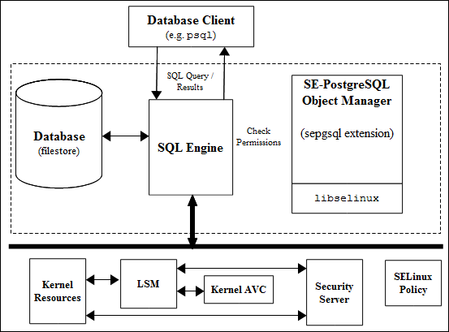

# PostgreSQL SELinux Support

- [sepgsql Overview](#sepgsql-overview)
- [Installing SE-PostgreSQL](#installing-se-postgresql)
- [*SECURITY LABEL* SQL Command](#security-label-sql-command)
- [Additional SQL Functions](#additional-sql-functions)
- [*postgresql.conf* Entries](#postgresql.conf-entries)
- [Logging Security Events](#logging-security-events)
- [Internal Tables](#internal-tables)

This section gives an overview of PostgreSQL version 11.x with the
*sepgsql* extension to support SELinux. It assumes some basic knowledge
of PostgreSQL that can be found at:
<http://wiki.postgresql.org/wiki/Main_Page>

It is important to note that PostgreSQL from version 11.x has the
necessary infrastructure to support labeling of database objects via
external 'providers'. The *sepgsql* extension has therefore been added
that provides SELinux labeling. The extension is not installed by
default but as an option as outlined in the sections that follow.
Because of these changes the original version 9.0 patches are no longer
supported (i.e. the SE-PostgreSQL database engine is replaced by the
PostgreSQL database engine plus the *sepgsql* extension). A consequence
of this change is that row level labeling is no longer supported by
SELinux, however a Row Level Security (RLS) option has now been added
within core PostgreSQL that does not utilise labeling.

The features of sepgsql 11.x and its setup are covered in the following
document:

<https://www.postgresql.org/docs/11/sepgsql.html>

## sepgsql Overview

The *sepgsql* extension adds SELinux mandatory access controls (MAC) to
database objects such as tables, columns, views, functions, schemas and
sequences. **Table 1: Database Security Context Information** shows a simple
database with one table and two columns, each with their object class and
associated security context (the [**Internal Tables**](#internal-tables)
section shows these entries from the *testdb* database in the
[**Notebook sepgsql Example**](./notebook-examples/sepgsql/testdb-example.sql).
The database object classes and permissions are described in
[**Appendix A - Object Classes and Permissions**](object_classes_permissions.md#database-object-classes).

|       |
| :---: |
| **database** (*db_database*) - context = 'unconfined_u:object_r:postgresql_db_t:s0' This context is inherited from the database directory label -  ls -Z /var/lib/pgsql/data |
| **schema** (*db_schema*) - security_label = 'unconfined_u:object_r:sepgsql_schema_t:s0:c10' |
| **table** (*db_table*)   - security_label = 'unconfined_u:object_r:sepgsql_table_t:s0:c20'  |

|       |       |
| :---: | :---: |
| **column 1** (*db_column*) - security_label = 'unconfined_u:object_r:sepgsql_table_t:s0:c30' | **column 2** - (*db_column*) security_label = 'unconfined_u:object_r:sepgsql_table_t:s0:c40' |

**Table 1: Database Security Context Information** - *Showing the security contexts that can be associated to a schema, table and columns.*

To use SE-PostgreSQL each Linux user must have a valid PostgreSQL
database role (not to be confused with an SELinux role). The default
installation automatically adds a user called *pgsql* with a suitable
database role.

If a client is connecting remotely and labeled networking is required,
then it is possible to use IPSec or NetLabel as discussed in the
[**SELinux Networking Support**](network_support.md#selinux-networking-support)
section (the "[**Security-Enhanced PostgreSQL Security Wiki**](http://wiki.postgresql.org/wiki/SEPostgreSQL_Development)"
also covers these methods of connectivity with examples).

Using **Figure 24a: SE-PostgreSQL Services**, the database client application
(that could be provided by an API for Perl/PHP or some other programming
language) connects to a database and executes SQL commands. As the SQL
commands are processed by PostgreSQL, each operation performed on an object
is checked by the object manager (OM) to see if the operation is allowed
by the security policy or not.



**Figure 24a: SE-PostgreSQL Services** - *The Object Manager checks access
permissions for all objects under its control.*

SE-PostgreSQL supports SELinux services via the *libselinux* library
with AVC audits being logged via the standard PostgreSQL logfile as
described in the [**Logging Security Events**](#logging-security-events)
section.

## Installing SE-PostgreSQL

The [**https://www.postgresql.org/docs/11/sepgsql.html**](https://www.postgresql.org/docs/11/sepgsql.html)
page contains all the information required to install the *sepgsql* extension.

There are also instructions in the
[**Notebook sepgsql Example - README**](./notebook-examples/sepgsql/README.md)
that describes building the example database used in the sections below.

## *SECURITY LABEL* SQL Command

The '*SECURITY LABEL*' SQL command has been added to PostgreSQL to allow
security providers to label or change a label on database objects.
The full syntax is defined in the ***security_label**(7)* man page, with some
examples:

```
-- These set the security label on objects (default provider being SELinux):

SECURITY LABEL ON SCHEMA test_ns IS
'unconfined_u:object_r:sepgsql_schema_t:s0:c10';

SECURITY LABEL ON TABLE test_ns.info IS
'unconfined_u:object_r:sepgsql_table_t:s0:c20';

SECURITY LABEL ON COLUMN test_ns.info.user_name IS
'unconfined_u:object_r:sepgsql_table_t:s0:c30';

SECURITY LABEL ON COLUMN test_ns.info.email_addr IS
'unconfined_u:object_r:sepgsql_table_t:s0:c40';
```

## Additional SQL Functions

The following functions have been added:

*sepgsql_getcon()*

Returns the client security context.

*sepgsql_mcstrans_in(text con)*

Translates the readable *range* of the context into raw format provided the
***mcstransd**(8)* daemon is running.

*sepgsql_mcstrans_out(text con)*

Translates the raw *range* of the context into readable format provided the
***mcstransd**(8)* daemon is running.

*sepgsql_restorecon(text specfile)*

Sets security contexts on all database objects (must be superuser) according
to the *specfile*. This is normally used for initialisation of the database
by the *sepgsql.sql* script. If the parameter is NULL, then the default
*sepgsql_contexts* file is used. See ***selabel_db**(5)* details.

## *postgresql.conf* Entries

The *postgresql.conf* file supports the following additional entries to
enable and manage SE-PostgreSQL:

- This entry is mandatory to enable the *sepgsql* extension to be loaded:

```
shared_preload_libraries = 'sepgsql'
```

- These entries are optional and default to '*off*'.

```
# This enables sepgsql to always run in permissive mode:
sepgsql.permissive = on

# This enables printing of audit messages regardless of the policy setting:
sepgsql.debug_audit = on
```

To view these settings the *SHOW* SQL statement can be used (*psql* output shown):

```
SHOW sepgsql.permissive;
sepgsql.permissive
---------------
on
(1 row)
```

```
SHOW sepgsql.debug_audit;
sepgsql.debug_audit
---------------
on
(1 row)
```

## Logging Security Events

SE-PostgreSQL manages its own AVC audit entries in the standard
PostgreSQL log normally located within the */var/lib/pgsql/data/pg_log*
directory and by default only errors are logged (Note that there are no
SE-PostgreSQL AVC entries added to the standard *audit.log*). The
'*sepgsql.debug_audit = on*' can be set to log all audit events.

## Internal Tables

To support the overall database operation PostgreSQL has internal tables
in the system catalog that hold information relating to databases,
tables etc. This section will only highlight the *pg_seclabel* table
that holds the security label and other references. The *pg_seclabel*
is shown in the table below and has been taken from
<http://www.postgresql.org/docs/11/static/catalog-pg-seclabel.html>.


| **Name** | **Type** | **References** | **Comments** |
| -------- | -------- | -------------- | ------------ |
| objoid   |   oid    | any OID column | The OID of the object this security label pertains to. |
| classoid |   oid    | pg_class.oid   | The OID of the system catalog this object appears in.  |
| objsubid |  int4    |                | For a security label on a table column, this is the column number (the *objoid* and *classoid* refer to the table itself). For all other objects this column is zero. |
| provider |  text    |                 | The label provider associated with this label. Currently only SELinux is supported. |
| label    |  text    |                 | The security label applied to this object. |


These are entries taken from a '*SELECT * FROM pg_seclabel;*' command
that refers to the example *testdb* database built using the
[**Notebook - testdb-example.sql**](./notebook-examples/sepgsql/testdb-example.sql):

```
objoid  | classoid | objsubid | provider |          label
--------+----------+----------+----------+----------------------------------------------
16390   | 2615     |    0     | selinux  | unconfined_u:object_r:sepgsql_schema_t:s0:c10
16391   | 1259     |    0     | selinux  | unconfined_u:object_r:sepgsql_table_t:s0:c20
16391   | 1259     |    1     | selinux  | unconfined_u:object_r:sepgsql_table_t:s0:c30
16391   | 1259     |    2     | selinux  | unconfined_u:object_r:sepgsql_table_t:s0:c40
```

The first entry is the schema, the second entry is the table itself, and
the third and fourth entries are columns 1 and 2.

There is also a built-in 'view' to show additional detail regarding
security labels called '*pg_seclabels*'. Using '*SELECT * FROM
pg_seclabels;*' command, the entries shown above become:

```
objoid|classoid|objsubid|objtype|objnamespace|  objname     | provider| label
------+--------+--------+-------+------------+--------------+---------+------------------------
16390 | 2615   |    0   | schema| 16390      | test_ns      | selinux | unconfined_u:object_r:sepgsql_schema_t:s0:c10
16391 | 1259   |    0   | table | 16390      | test_ns.info | selinux | unconfined_u:object_r:sepgsql_table_t:s0:c20
16391 | 1259   |    1   | column| 16390      | test_ns.info.| selinux | unconfined_u:object_r:sepgsql_table_t:s0:c30
      |        |        |       |            | user_name    |         |
16391 | 1259   |    2   | column| 16390      | test_ns.info.| selinux | unconfined_u:object_r:sepgsql_table_t:s0:c40
      |        |        |       |            | email_addr   |         |
```

<!-- %CUTHERE% -->

---
**[[ PREV ]](x_windows.md)** **[[ TOP ]](#)** **[[ NEXT ]](apache_support.md)**
