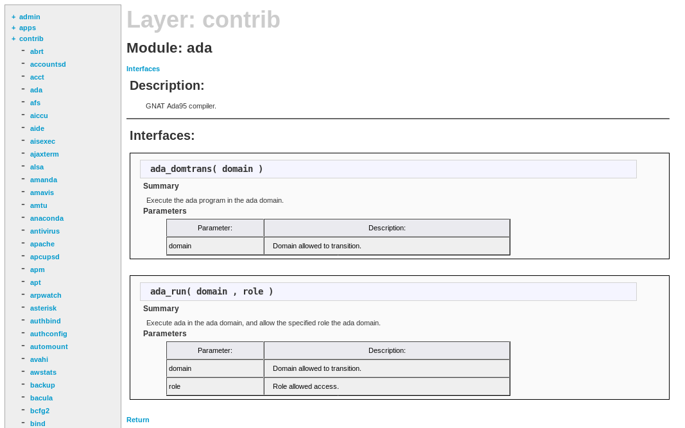
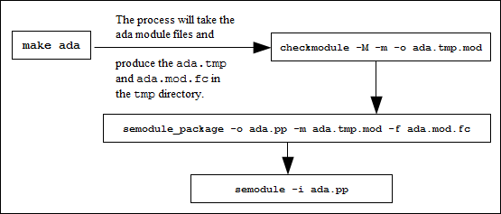

# The Reference Policy

- [Reference Policy Overview](#reference-policy-overview)
  - [Distributing Policies](#distributing-policies)
  - [Policy Functionality](#policy-functionality)
  - [Reference Policy Module Files](#reference-policy-module-files)
- [Reference Policy Source](#reference-policy-source)
  - [Source Layout](#source-layout)
  - [Reference Policy Files and Directories](#reference-policy-files-and-directories)
  - [Source Configuration Files](#source-configuration-files)
    - [Reference Policy Build Options - build.conf](#reference-policy-build-options---build.conf)
    - [Reference Policy Build Options - policy/modules.conf](#reference-policy-build-options---policymodules.conf)
      - [Building the modules.conf File](#building-the-modules.conf-file)
  - [Source Installation and Build Make Options](#source-installation-and-build-make-options)
  - [Booleans, Global Booleans and Tunable Booleans](#booleans-global-booleans-and-tunable-booleans)
  - [Modular Policy Build Structure](#modular-policy-build-structure)
    - [Base Module Build](#base-module-build)
    - [Module Build](#module-build)
  - [Creating Additional Layers](#creating-additional-layers)
- [Installing and Building the Reference Policy Source](#installing-and-building-the-reference-policy-source)
  - [Building Standard Reference Policy](#building-standard-reference-policy)
  - [Building the Fedora Policy](#building-the-fedora-policy)
- [Reference Policy Headers](#reference-policy-headers)
  - [Building and Installing the Header Files](#building-and-installing-the-header-files)
  - [Using the Reference Policy Headers](#using-the-reference-policy-headers)
  - [Using Fedora Supplied Headers](#using-fedora-supplied-headers)
- [Reference Policy Support Macros](#reference-policy-support-macros)
  - [Loadable Policy Macros](#loadable-policy-macros)
    - [*policy_module* Macro](#policy_module-macro)
    - [*gen_require* Macro](#gen_require-macro)
    - [*optional_policy* Macro](#optional_policy-macro)
    - [*gen_tunable* Macro](#gen_tunable-macro)
    - [*tunable_policy* Macro](#tunable_policy-macro)
    - [*interface* Macro](#interface-macro)
    - [*template* Macro](#template-macro)
  - [Miscellaneous Macros](#miscellaneous-macros)
    - [*gen_context* Macro](#gen_context-macro)
    - [*gen_user* Macro](#gen_user-macro)
    - [*gen_bool* Macro](#gen_bool-macro)
  - [MLS and MCS Macros](#mls-and-mcs-macros)
    - [*gen_cats* Macro](#gen_cats-macro)
    - [*gen_sens* Macro](#gen_sens-macro)
    - [*gen_levels* Macro](#gen_levels-macro)
  - [*ifdef* / *ifndef* Parameters](#ifdef-ifndef-parameters)
    - [*hide_broken_symptoms*](#hide_broken_symptoms)
    - [*enable_mls* and *enable_mcs*](#enable_mls-and-enable_mcs)
    - [*enable_ubac*](#enable_ubac)
    - [*direct_sysadm_daemon*](#direct_sysadm_daemon)
- [Module Expansion Process](#module-expansion-process)

The [**Reference Policy**](https://github.com/SELinuxProject/refpolicy)
is now the standard policy source used to build Linux SELinux
policies. This provides a single source tree with supporting
documentation that can be used to build policies for different
purposes such as: confining important daemons, supporting MLS / MCS
type policies and locking down systems so that all processes are under
SELinux control.

This section details how the Reference Policy is:

1. Constructed and types of policy builds supported.
2. Adding new modules to the build.
3. Installation as a full Reference Policy source or as Header files.
4. Impact of the migration process being used to convert compiled
   module files (*\*.pp*) to CIL.
5. Modifying the configuration files to build new policies.
6. Explain the support macros.

Note that the Reference Policy uses **NAME** to define the policy name. This
then becomes part of the policy location (i.e. */etc/selinux/\<NAME\>*).
In most documentation the policy name is defined using the
*\<SELINUXTYPE\>* convention, as that is from the
*/etc/selinux/config* file entry **SELINUXTYPE=**. This part of the Notebook
uses both forms.

### Reference Policy Overview

Strictly speaking the 'Reference Policy' should refer to the policy
taken from the master repository or the latest released version. This is
because most Linux distributors take a released version and then tailor it to
their specific requirements.

All examples in this section are based on the master Reference Policy
repository that can be checked out using the following:

```
# Check out the core policy:
git clone https://github.com/SELinuxProject/refpolicy.git
```

A list of releases can be found at <https://github.com/SELinuxProject/refpolicy/releases>

The Fedora distribution is built from a specific standard Reference Policy
build, modified and distributed by Red Hat as a source RPM. These RPMs can be
obtained from <http://koji.fedoraproject.org>. The master Fedora policy source
can be found at: <https://github.com/fedora-selinux/selinux-policy>

**Figure 26: The Reference Policy Source Tree** shows the layout of the
reference policy source tree, that once installed would be located at
```
/etc/selinux/<SELINUXTYPE>/src/policy
```

Where the **\<SELINUXTYPE\>** entry is taken from the *build.conf* file
as discussed in the
[**Reference Policy Build Options** - *build.conf*](#reference-policy-build-options---build.conf)
section. The
[**Installing and Building the Reference Policy Source**](#installing-and-building-the-reference-policy-source)
section explains a simple build from source.


**Figure 26: The Reference Policy Source Tree** - *When building a modular
policy, files are added to the policy store. For monolithic builds the policy
store is not used.*

The Reference Policy can be used to build two policy types:

1. **Loadable Module Policy** - A policy that has a
   base module for core services and has the ability to load / unload
   modules to support applications as required. This is now the
   standard used by Linux distributions.
2. **Monolithic Policy** - A policy that has all the
   required policy information in a single base policy and does not
   require the services of the module infrastructure (***semanage**(8)*
   or ***semodule**(8)*). These are more suitable for embedded or
   minimal systems.

Each of the policy types are built using module files that define the
specific rules required by the policy as detailed in the
[**Reference Policy Module Files**](#reference-policy-module-files) section.
Note that the monolithic policy is built using the same module files by
forming a single 'base' source file.

The Reference Policy relies heavily on the ***m4**(1)* macro processor
as the majority of supporting services are m4 macros.

### Distributing Policies

It is possible to distribute the Reference Policy in two forms:

1. As source code that is then used to build policies. This is not the
   general way policies are distributed as it contains the complete
   source that most administrators do not need. The
   [**Reference Policy Source**](#reference-policy-source) section describes
   the source and the
   [**Installing and Building the Reference Policy Source**](#installing-and-building-the-reference-policy-source)
   section describes how to install the source and build a policy.
2. As 'Policy Headers'. This is the most common way to distribute the
   Reference Policy. Basically, the modules that make up 'the
   distribution' are pre-built and then linked to form a base and
   optional modules. The 'headers' that make-up the policy are then
   distributed along with makefiles and documentation. A policy writer
   can then build policy using the core modules supported by the
   distribution, and using development tools they can add their own
   policy modules. The
   [**Reference Policy Headers**](#reference-policy-headers) section describes
   how these are installed and used to build modules.

The policy header files and documentation for Fedora are distributed in:

- **selinux-policy** - Contains the SELinux */etc/selinux/config* file
  and rpm macros
- **selinux-policy-devel** - Contains the 'Policy Header' development
  environment that is located at */usr/share/selinux/devel*
- **selinux-policy-doc** - Contains man pages and the html policy
  documentation that is located at */usr/share/doc/selinux-policy/html*

These rpms contain a specific policy type containing configuration files and
packaged policy modules (*\*.pp*). The policy will be installed in the
*/etc/selinux/\<SELINUXTYPE\>* directory, along with its configuration files.

- **selinux-policy-targeted** - This is the default Fedora policy.
- selinux-policy-minimum
- selinux-policy-mls

The selinux-policy-sandbox rpm contains the sandbox module for use by the
*policycoreutils-sandbox* package. This will be installed as a module for
one of the three main policies described above.

### Policy Functionality

As can be seen from the policies distributed with Fedora above, they can
be classified by the name of the functionality they support (taken from
the *SELINUXTYPE* entry of the *build.conf* as shown in the
[**Reference Policy Build Options - build.conf**](#reference-policy-build-options---build.conf)
section, for example the Fedora policies support:

- minimum - MCS policy that supports a minimal set of confined daemons
  within their own domains. The remainder run in the *unconfined_t* space.
- targeted - MCS policy that supports a greater number of confined daemons
  and can also confine other areas and users.
- mls - MLS policy for server based systems.

### Reference Policy Module Files

The reference policy modules are constructed using a mixture of
[**support macros**](#reference-policy-support-macros),
[**interface calls**](#interface-macro) and
[**Kernel Policy Language Statements**](kernel_policy_language.md#kernel-policy-language),
using three principle types of source file:

- A private policy file that contains statements required to enforce
  policy on the specific GNU / Linux service being defined within the
  module. These files are named *\<module_name\>.te*. For example the
  *ada.te* file shown below has two statements:
  - one to state that the *ada_t* process has permission to write to
    the stack and memory allocated to a file.
  - one that states that if the *unconfined_domain* module is loaded, then
    allow the *ada_t* domain unconfined access. Note that if the
    flow of this statement is followed it will be seen that many
    more interfaces and macros are called to build the final raw
    SELinux language statements. An expanded module source isshown in the
    [**Module Expansion Process**](#module-expansion-process) section.
- An external interface file that defines the services available to
  other modules. These files are named *\<module_name\>.if*.
  For example the *ada.if* file shown below has two interfaces defined for
  other modules to call:
  - *ada_domtrans* - that allows another module (running in domain *$1*) to
    run the ada application in the *ada_t* domain.
  - *ada_run* - that allows another module to run the ada application in
    the *ada_t* domain (via the *ada_domtrans* interface), then
    associate the *ada_t* domain to the caller defined role (*$2*) and
    terminal (*$3*). Provided of course that the caller domain has
    permission. Note that there are two types of interface specification:
  - **Access Interfaces** - These are the most
    common and define interfaces that *.te* modules can call as described
    in the ada examples. They are generated by the *interface* macro as
    detailed in the [*interface*](#interface-macro) section.
  - **Template Interfaces** - These are required whenever a module is
    required in different domains and allows the type(s) to be redefined by
    adding a prefix supplied by the calling module. The basic idea is to
    set up an application in a domain that is suitable for the defined
    SELinux user and role to access but not others. These are generated by
    the *template* macro as detailed in the [*template*](#template-macro)
    section.
- A file labeling file that defines the labels to be added to files
  for the specified module. These files are named
  *\<module_name\>.fc*. The build process will amalgamate all the
  *\*.fc* files and finally form the
  [***file_contexts***](policy_config_files.md#contextsfilesfile_contexts)
  file that will be used to label the filesystem. For example the *ada.fc*
  file shown below requires that the specified files are labeled
  *system_u:object_r:ada_exec_t:s0*. The *\<module_name\>* must be unique
  within the reference policy source tree and should reflect the specific
  Linux service being enforced by the policy.

The following examples from the ada module files show how they are
made from the Policy Macros, Interface calls and kernel policy statements
and rules:

**ada.te file contents:**

```
policy_module(ada, 1.5.0)

########################################
#
# Declarations
#

attribute_role ada_roles;			# Kernel policy statement
roleattribute system_r ada_roles;

type ada_t;
type ada_exec_t;
application_domain(ada_t, ada_exec_t)		# call into 'application.if'
role ada_roles types ada_t;

########################################
#
# Local policy
#

allow ada_t self:process { execstack execmem };

userdom_use_inherited_user_terminals(ada_t)	# call into 'userdomain.if'

optional_policy(`				# Macro in loadable_module.spt
	unconfined_domain(ada_t)
')

```

**ada.if 'interface calls' file contents:**

```
## <summary>GNAT Ada95 compiler.</summary>

########################################
## <summary>
##	Execute the ada program in the ada domain.
## </summary>
## <param name="domain">
##	<summary>
##	Domain allowed to transition.
##	</summary>
## </param>
#
interface(*ada_domtrans',*			# Defining an interface
	gen_require(`				# Macro in loadable_module.spt
		type ada_t, ada_exec_t;
	')

	corecmd_search_bin($1)
	domtrans_pattern($1, ada_exec_t, ada_t)	# Macro in misc_patterns.spt
')

########################################
## <summary>
##	Execute ada in the ada domain, and
##	allow the specified role the ada domain.
## </summary>
## <param name="domain">
##	<summary>
##	Domain allowed to transition.
##	</summary>
## </param>
## <param name="role">
##	<summary>
##	Role allowed access.
##	</summary>
## </param>
#
interface(*ada_run',*
	gen_require(`
		attribute_role ada_roles;
	')

	ada_domtrans($1)
	roleattribute $2 ada_roles;		# Kernel policy statement
')

```

**ada.fc file contents:**

```
				# gen_context is a macro in misc_macros.spt
/usr/bin/gnatbind	--	gen_context(system_u:object_r:ada_exec_t,s0)
/usr/bin/gnatls	--	gen_context(system_u:object_r:ada_exec_t,s0)
/usr/bin/gnatmake	--	gen_context(system_u:object_r:ada_exec_t,s0)

/usr/libexec/gcc(/.*)?/gnat1	--	gen_context(system_u:object_r:ada_exec_t,s0)
```

### Reference Policy Documentation

One of the advantages of the reference policy is that it is possible to
automatically generate documentation as a part of the build process.
This documentation is defined in XML and generated as HTML files
suitable for viewing via a browser.

The documentation for Fedora can be viewed in a browser using
[*/usr/share/doc/selinux-policy/html/index.html*](/usr/share/doc/selinux-policy/html/index.html)
once the *selinux-policy-doc* rpm has been installed.
The documentation for the Reference Policy source will be available at
*\<location\>/src/policy/doc/html* once *make html* has been executed
(the *\<location\>* is the location of the installed source after
*make install-src* has been executed as described in the
[**Installing and Building the Reference Policy Source**](#installing-and-building-the-reference-policy-source)
section). The Reference Policy documentation may also be available at a
default location of */usr/share/doc/refpolicy-\<VERSION\>/html* if
*make install-doc* has been executed (where *\<VERSION/>* is the entry from the
source *VERSION* file.

**Figure 27** shows an example screen shot of the documentation produced for
the ada module interfaces.



**Figure 27: Example Documentation Screen Shot**

## Reference Policy Source

This section explains the source layout and configuration files, with
the actual installation and building covered in the
[**Installing and Building the Reference Policy Source**](#installing-and-building-the-reference-policy-source)
section.

The source has a README file containing information on the configuration
and installation processes that has been used within this section (and
updated with the authors comments as necessary). There is also a VERSION
file that contains the Reference Policy release date, this can then be used to
obtain a change list <https://github.com/SELinuxProject/refpolicy/releases>.

### Source Layout

**Figure 26: The Reference Policy Source Tree** shows the layout of the
reference policy source tree, that once installed would be located at:

*/etc/selinux/\<SELINUXTYPE\>/src/policy*

The following sections detail the source contents:

- [**Reference Policy Files and Directories**](#reference-policy-files-and-directories) -
  Describes the files and their location.
- [**Source Configuration Files**](#source-configuration-files) -
  Details the contents of the *build.conf* and *modules.conf*
  configuration files.
- [**Source Installation and Build Make Options**](#source-installation-and-build-make-options) -
  Describes the *make* targets.
- [**Modular Policy Build Structure**](#modular-policy-build-structure) -
  Describes how the various source files are linked together to form a
  base policy module *base.conf* during the build process.

The
[**Installing and Building the Reference Policy Source**](#installing-and-building-the-reference-policy-source)
section then describes how the initial source is installed and
configured to allow a policy to be built.

### Reference Policy Files and Directories

The **Reference Policy Files and Directories** list shows the major
files and their directories with a description of each taken from the
README file (with comments added). All directories are relative to the root of
the [Reference Policy](https://github.com/SELinuxProject/refpolicy) source directory
[*./policy*](https://github.com/SELinuxProject/refpolicy/tree/master/policy).

The *build.conf* and *modules.conf* configuration files are further detailed
in the [**Source Configuration Files**](#source-configuration-files)
section as they define how the policy will be built.

During the build process, a file is generated in the *./policy* directory
called either *policy.conf* or *base.conf* depending whether a monolithic or
modular policy is being built. This file is explained in the
[**Modular Policy Build Structure**](#modular-policy-build-structure) section.

**Reference Policy Files and Directories:**

[*Makefile*](https://github.com/SELinuxProject/refpolicy/tree/master/Makefile)

- General rules for building the policy.

[*Rules.modular*](https://github.com/SELinuxProject/refpolicy/tree/master/Rules.modular)

- Makefile rules specific to building loadable module policies.

[*Rules.monolithic*](https://github.com/SELinuxProject/refpolicy/tree/master/Rules.monolithic)

- Makefile rules specific to building monolithic policies.

[*build.conf*](https://github.com/SELinuxProject/refpolicy/tree/master/build.conf)

- Options which influence the building of the policy, such as the policy type
  and distribution. This file is described in the
  [**Reference Policy Build Options - build.conf**](#reference-policy-build-options---build.conf)
  section.

[*config*](https://github.com/SELinuxProject/refpolicy/tree/master/config)*/appconfig-\<type\>*

- Application configuration files for all configurations of the Reference
  Policy where *\<type\>* is taken from the *build.conf* **TYPE** entry that
  are currently: standard, MLS and MCS). These files are used by SELinux-aware
  programs and described in the
  [**SELinux Configuration Files**](policy_config_files.md#policy-configuration-files)
  section.

[*config/file_contexts.subs_dist*](https://github.com/SELinuxProject/refpolicy/tree/master/config/file_contexts.subs_dist)

- Used to configure file context aliases (see the
  [**contexts/files/file_contexts.subs and file_contexts.subs_dist File**](policy_config_files.md#contextsfilesfile_contexts.subs)
  section).

[*config/local.users*](https://github.com/SELinuxProject/refpolicy/tree/master/config/local.users)

- The file read by load policy for adding SELinux users to the policy on
  the fly. Note that this file is not used in the modular policy build.

[*doc/html*](https://github.com/SELinuxProject/refpolicy/tree/master/doc/html)*/\**

- When *make html* has been executed, contains the in-policy XML
  documentation, presented in web page form.

[*doc/policy.dtd*](https://github.com/SELinuxProject/refpolicy/tree/master/doc/policy.dtd)

- The *doc/policy.xml* file is validated against this DTD.

[*doc/policy.xml*](https://github.com/SELinuxProject/refpolicy/tree/master/doc/policy.xml)

- This file is generated/updated by the conf and html make targets.
  It contains the complete XML documentation included in the policy.

[*doc/templates*](https://github.com/SELinuxProject/refpolicy/tree/master/doc/templates)*/\**

- Templates used for documentation web pages.

[*man*](https://github.com/SELinuxProject/refpolicy/tree/master/man)*/\**

- Various man pages for modules (ftp, http etc.)

[*support*](https://github.com/SELinuxProject/refpolicy/tree/master/support)*/\**

- Tools used in the build process.

[*policy/flask/initial_sids*](https://github.com/SELinuxProject/refpolicy/tree/master/policy/flask/initial_sids)

- This file has declarations for each initial SID. The file usage in policy
  generation is described in the
  [**Modular Policy Build Structure**](#modular-policy-build-structure)
  section.

[*policy/flask/security_classes*](https://github.com/SELinuxProject/refpolicy/tree/master/policy/flask/security_classes)

- This file has declarations for each security class. The file usage in
  policy generation is described in the
  [**Modular Policy Build Structure**](#modular-policy-build-structure)
  section.

[*policy/flask/access_vectors*](https://github.com/SELinuxProject/refpolicy/tree/master/policy/flask/access_vectors)

- This file defines the common permissions and class specific permissions
  and is described in the [**Modular Policy Build Structure**](#modular-policy-build-structure)
  section.

[*policy/modules*](https://github.com/SELinuxProject/refpolicy/tree/master/policy/modules)*/\**

- Each directory represents a layer in Reference Policy. All of the modules
  are contained in one of these layers. The *contrib* modules are supplied
  externally to the Reference Policy, then linked into the build. The files
  present in each directory are: *metadata.xml* that describes the layer and
  *\<module_name\>.te*, *.if* and *.fc* that contain policy source as
  described in the [**Reference Policy Module Files**](#reference-policy-module-files)
  section. The file usage in policy generation is described in the
  [**Modular Policy Build Structure**](#modular-policy-build-structure)
  section.

[*policy/support*](https://github.com/SELinuxProject/refpolicy/tree/master/policy/support)*/\**

- Reference Policy support macros are described in the
  [**Reference Policy support Macros**](#reference-policy-support-macros)
  section.

[*policy/booleans.conf*](https://github.com/SELinuxProject/refpolicy/tree/master/policy/booleans.conf)

- This file is generated/updated by *make conf*. It contains the booleans in
  the policy and their default values. If tunables are implemented as
  booleans, tunables will also be included. This file will be installed as
  the */etc/selinux/\<NAME\>/booleans file* (note that this is not true for
  any system that implements the modular policy - see the
  [**Booleans, Global Booleans and Tunable Booleans**](#booleans-global-booleans-and-tunable-booleans)
  section).

[*policy/constraints*](https://github.com/SELinuxProject/refpolicy/tree/master/policy/constraints)

- This file defines constraints on permissions in the form of boolean
  expressions that must be satisfied in order for specified permissions to
  be granted. These constraints are used to further refine the type
  enforcement rules and the role allow rules. Typically, these constraints
  are used to restrict changes in user identity or role to certain domains.
  (Note that this file does not contain the MLS / MCS constraints as they
  are in the *mls* and *mcs* files described below). The file usage in policy
  generation is described in the
  [**Modular Policy Build Structure**](#modular-policy-build-structure) section.

[*policy/context_defaults*](https://github.com/SELinuxProject/refpolicy/tree/master/policy/context_defaults)

- This would contain any specific *default_user*, *default_role*,
  *default_type* and/or *default_range* rules required by the policy.

[*policy/global_booleans*](https://github.com/SELinuxProject/refpolicy/tree/master/policy/global_booleans)

- This file defines all booleans that have a global scope, their default
  value, and documentation. See the
  [**Booleans, Global Booleans and Tunable Booleans**](#booleans-global-booleans-and-tunable-booleans)
  section.

[*policy/global_tunables*](https://github.com/SELinuxProject/refpolicy/tree/master/policy/global_tunables)

- This file defines all tunables that have a global scope, their default
  value, and documentation.
  See the [**Booleans, Global Booleans and Tunable Booleans**](#booleans-global-booleans-and-tunable-booleans)
  section.

[*policy/mcs*](https://github.com/SELinuxProject/refpolicy/tree/master/policy/mcs)

- This contains information used to generate the *sensitivity*, *category*,
  *level* and *mlsconstraint* statements used to define the MCS configuration.
  The file usage in policy generation is described in the
  [**Modular Policy Build Structure**](#modular-policy-build-structure) section.

[*policy/mls*](https://github.com/SELinuxProject/refpolicy/tree/master/policy/mls)

- This contains information used to generate the *sensitivity*, *category*,
  *level* and *mlsconstraint* statements used to define the MLS configuration.
  The file usage in policy generation is described in the
  [**Modular Policy Build Structure**](#modular-policy-build-structure) section.

*policy/modules.conf*

- This file contains a listing of available modules, and how they will be
  used when building Reference Policy. To prevent a module from being used,
  set the module to "off". For monolithic policies, modules set to "base" and
  "module" will be included in the policy. For modular policies, modules set
  to "base" will be included in the base module; those set to "module" will
  be compiled as individual loadable modules. This file is described in the
  [**Reference Policy Build Options - policy/modules.conf**](#reference-policy-build-options---policymodules.conf)
  section.

[*policy/policy_capabilities*](https://github.com/SELinuxProject/refpolicy/tree/master/policy/policy_capabilities)

- This file defines the policy capabilities that can be enabled in the policy.
  The file usage in policy generation is described in the
  [**Modular Policy Build Structure**](#modular-policy-build-structure) section.

[*policy/users*](https://github.com/SELinuxProject/refpolicy/tree/master/policy/users)

- This file defines the users included in the policy. The file usage in policy
  generation is described in the
  [**Modular Policy Build Structure**](#modular-policy-build-structure) section.

*securetty_types* and *setrans.conf*

- These files are not part of the standard Reference Policy distribution but
  are added by Fedora source updates.

### Source Configuration Files

There are two major configuration files ([*build.conf*](https://github.com/SELinuxProject/refpolicy/tree/master/build.conf) and *modules.conf*)
that define the policy to be built and are detailed in this section.

#### Reference Policy Build Options - [build.conf](https://github.com/SELinuxProject/refpolicy/tree/master/build.conf)

This file defines the policy type to be built that will influence its
name and where the source will be located once it is finally installed.
An example file content is shown in the
[**Installing and Building the Reference Policy Source**](#installing-and-building-the-reference-policy-source)
section where it is used to install and then build the policy.

The *build.conf* **Entries** below explains the fields that can be
defined within this file. The supplied fields will then be used by the *make*
process to set *m4* macro parameters. These macro definitions are also used
within the module source files to control how the policy is built with examples
shown in the [***ifdef***](#ifdef-ifndef-parameters) section.

**[*build.conf*](https://github.com/SELinuxProject/refpolicy/tree/master/build.conf) Entries:**

*TYPE*

- String - Available options are *standard*, *mls*, and *mcs*. For a type
  enforcement only system, set standard. This optionally enables multi-level
  security (MLS) or multi-category security (MCS) features. This option
  controls *enable_mls*, and *enable_mcs* policy blocks.

*NAME*

- String (optional) - Sets the name of the policy; the *\<NAME\>* is used when
  installing files to e.g., */etc/selinux/\<NAME\>* and
  */usr/share/selinux/\<NAME\>*. If not set, the policy type (*TYPE*) is used.

*DISTRO*

- String (optional) - Enable distribution-specific policy. Available options
  are redhat, gentoo, and debian. This option controls *distro_redhat*,
  *distro_gentoo*, and *distro_debian* build option policy blocks.

*MONOLITHIC*

- Boolean - If set, a monolithic policy is built, otherwise a modular policy
  is built.

*DIRECT_INITRC*

- Boolean - If set, sysadm will be allowed to directly run init scripts,
  instead of requiring the *run_init* tool.  This is a build option instead
  of a tunable since role transitions do not work in conditional policy. This
  option controls *direct_sysadm_daemon* policy blocks.

*OUTPUT_POLICY*

- Integer - Set the version of the policy created when building a monolithic
policy. This option has no effect on modular policy.

*UNK_PERMS*

- String - Set the kernel behavior for handling of permissions defined in the
  kernel but missing from the policy. The permissions can either be allowed
  (*allow*), denied (*deny*), or the policy loading can be rejected (*reject*).

*UBAC*

- Boolean - If set, the SELinux user will be used additionally for approximate
  role separation.

*SYSTEMD*

- Boolean - If set, ***systemd**(1)* will be assumed to be the init process
  provider.

*MLS_SENS*

- Integer - Set the number of sensitivities in the MLS policy. Ignored on
  *TYPE* entries of *standard* and *mcs*.

*MLS_CATS*

- Integer - Set the number of categories in the MLS policy. Ignored on
  *TYPE* entries of *standard* and *mcs*.

*MCS_CATS*

- Integer - Set the number of categories in the MCS policy. Ignored on
  *TYPE* entries of *standard* and *mls*.

*QUIET*

- Boolean - If set, the build system will only display status messages and
  error messages. This option has no effect on policy.

*WERROR*

- Boolean - If set, the build system will treat warnings as errors. If any
  warnings are encountered, the build will fail.

#### Reference Policy Build Options - policy/modules.conf

This file will not be present until *make conf* is run and controls
what modules are built within the policy, see the
[**Building the modules.conf File**](#building-the-modules.conf-file) section.

**Example entries:**

```
# Layer: kernel
# Module: kernel
# Required in base
#
# Policy for kernel threads, proc filesystem,and unlabeled processes and
# objects.
#
kernel = base

# Layer: admin
# Module: amanda
#
# Advanced Maryland Automatic Network Disk Archiver.
#
amanda = module

# Layer: admin
# Module: ddcprobe
#
# ddcprobe retrieves monitor and graphics card information
#

ddcprobe = off
```

The only active lines (those without comments) contain:

```
<module_name> = base | module | off
```

However note that the comments are important as they form part of the
documentation when it is generated by the *make html* target.

**Where:**

*module_name*

- The name of the module to be included within the build.

*base*

- The module will be in the base module for a modular policy build
  (*build.conf* entry *MONOLITHIC* = n).

*module*

- The module will be built as a loadable module for a modular policy build.
  If a monolithic policy is being built (*build.conf* entry *MONOLITHIC* = y),
  then this module will be built into the base module.

*off*

- The module will not be included in any build.

Generally it is up to the policy distributor to decide which modules are
in the base and those that are loadable, however there are some modules
that MUST be in the base module. To highlight this there is a special
entry at the start of the modules interface file (*.if*) that has the
entry *\<required val="true"\>* as shown below (taken from the
*kernel.if* file):

```
## <summary>
##	Policy for kernel threads, proc filesystem,
##	and unlabeled processes and objects.
## </summary>
## <required val="true">
##	This module has initial SIDs.
## </required>
```

The *modules.conf* file will also reflect that a module is required in
the base by adding a comment 'Required in base' when the make conf
target is executed (as all the *.if* files are checked during this
process and the *modules.conf* file updated).

```
# Layer: kernel
# Module: kernel
# Required in base
#
# Policy for kernel threads, proc filesystem,
# and unlabeled processes and objects.
#
kernel = base
```

Those marked as *Required in base* are shown in the
**Mandatory modules.conf Entries** (note that Fedora and the standard
Reference Policy may be different)

**Mandatory *modules.conf* Entries: 'Layer - Module Name - Comments'**

*kernel*

- *corecommands*
  - Core policy for shells and generic programs in: */bin*, */sbin*,
    */usr/bin*, and */usr/sbin*. The *.fc* file sets up the labels for these
    items.
  - All the interface calls start with '*corecmd_*'.

- *corenetwork*
  - Policy controlling access to network objects and also contains the
    initial SIDs for these. The *.if* file is large and automatically
    generated.
  - All the interface calls start with '*corenet_*'.

- *devices*
  - This module creates the device node concept and provides the policy for
    many of the device files. Notable exceptions are the mass storage and
    terminal devices that are covered by other modules (that is a char or
    block device file, usually in */dev*). All types that are used to label
    device nodes should use the dev_node macro. Additionally this module
    controls access to:
    1. the device directories containing device nodes.
    2. device nodes as a group
    3. individual access to specific device nodes covered by this module.
  - All the interface calls start with '*dev_*'.

- *domain*
  - Contains the core policy for forming and managing domains.
  - All the interface calls start with '*domain_*'.

- *files*
  - This module contains basic filesystem types and interfaces and includes:
    1. The concept of different file types including basic files,
       mount points, tmp files, etc.
    2. Access to groups of files and all files.
    3. Types and interfaces for the basic filesystem layout
       (*/*, */etc*, */tmp* ...).
    4. Contains the file initial SID.
  - All the interface calls start with '*files_*'.

- *filesystem*
  - Contains the policy for filesystems and the initial SID.
  - All the interface calls start with '*fs_*'.

- *kernel*
  - Contains the policy for kernel threads, proc filesystem, and unlabeled
    processes and objects. This module has initial SIDs.
  - All the interface calls start with '*kernel_*'.

- *mcs*
  - Policy for Multicategory security. The *.te* file only contains
    attributes used in MCS policy.
  - All the interface calls start with '*mcs_*'.

- *mls*
  - Policy for Multilevel security. The *.te* file only contains attributes
    used in MLS policy. All the interface calls start with '*mls_*'.

- *selinux*
  - Contains the policy for the kernel SELinux security interface
    (*selinuxfs*).
  - All the interface calls start with '*selinux_*'.

- *terminal*
  - Contains the policy for terminals.
  - All the interface calls start with '*term_*'.

- *ubac*
  - Disabled by Fedora but enabled on standard Ref Policy. Support
    user-based access control.

*system*

- *application*
  - Enabled by Fedora but not standard Ref Policy. Defines attributes and
    interfaces for all user apps.

- *setrans*
  - Enabled by Fedora but not standard Ref Policy. Support for
    ***mcstransd**(8)*.

##### Building the modules.conf File

The file can be created by an editor, however it is generally built
initially by *make conf* that will add any additional modules to the file.
The file can then be edited to configure the required modules as base,
module or off.

As will be seen in the
[**Installing and Building the Reference Policy Source**](#installing-and-building-the-reference-policy-source)
section, the Fedora reference policy source comes with a number of
pre-configured files that are used to produce the required policy including
multiple versions of the *modules.conf* file.

### Source Installation and Build Make Options

This section explains the various make options available that have been
taken from the *README* file (with some additional minor comments).

**General Make targets:**

*install-src*

- Install the policy sources into */etc/selinux/\<NAME\>/src/policy*, where
  \<NAME\> is defined in the *build.conf* file. If it is not defined, then
  *TYPE* is used instead. If a *build.conf* does not have the information,
  then the Makefile will default to the current entry in the
  */etc/selinux/config* file or default to *refpolicy*. A pre-existing source
  policy will be moved to */etc/selinux/\<NAME\>/src/policy.bak*.

*conf*

- Regenerate *policy.xml*, and update/create *modules.conf* and
  *booleans.conf*. This should be done after adding or removing modules, or
  after running the bare target. If the configuration files exist, their
  settings will be preserved. This must be run on policy sources that are
  checked out from the CVS repository before they can be used. Note that if
  *make bare* has been executed before this make target, or it is a first
  build, then the *modules/kernel/corenetwork.??.in* files will be used to
  generate the *corenetwork.te* and *corenetwork.if* module files.
  These *\*.in* files may be edited to configure network ports etc.
  (see the *# network_node* example entries in *corenetwork.te*).

*clean*

- Delete all temporary files, compiled policy, and file_contexts.
  Configuration files are left intact.

*bare*

- Do the clean make target and also delete configuration files, web page
  documentation, and policy.xml.

*html*

- Regenerate *policy.xml* and create web page documentation in the
  *doc/html* directory.

*install-appconfig*

- Installs the appropriate SELinux-aware configuration files.

**Make targets specific to modular (loadable modules) policies:**

*base*

- Compile and package the base module. This is the default target for modular
  policies.

*modules*

- Compile and package all Reference Policy modules configured to be built as
  loadable modules.

*MODULENAME.pp*

- Compile and package the *MODULENAME* Reference Policy module.

*all*

- Compile and package the base module and all Reference Policy modules
  configured to be built as loadable modules.

*install*

- Compile, package, and install the base module and Reference Policy modules
  configured to be built as loadable modules.

*load*

- Compile, package, and install the base module and Reference Policy modules
  configured to be built as loadable modules, then insert them into the
  module store.

*validate*

- Validate if the configured modules can successfully link and expand.

*install-headers*

- Install the policy headers into */usr/share/selinux/\<NAME\>*. The headers
  are sufficient for building a policy module locally, without requiring the
  complete Reference Policy sources. The *build.conf* settings for this policy
  configuration should be set before using this target.

*install-docs*

- Build and install the documentation and example module source with Makefile.
  The default location is */usr/share/doc/refpolicy-\<VERSION\>*, where the
  version is the value in the *VERSION* file.

**Make targets specific to monolithic policies:**

*policy*

- Compile a policy locally for development and testing. This is the default
  target for monolithic policies.

*install*

- Compile and install the policy and file contexts.

*load*

- Compile and install the policy and file contexts, then load the policy.

*enableaudit*

- Remove all dontaudit rules from policy.conf.

*relabel*

- Relabel the filesystem.

*checklabels*

- Check the labels on the filesystem, and report when a file would be
  relabeled, but do not change its label.

*restorelabels*

- Relabel the filesystem and report each file that is relabeled.

### Booleans, Global Booleans and Tunable Booleans

The three files *booleans.conf*, *global_booleans* and *global_tunables* are
built and used as follows:

*booleans.conf*

- This file is generated / updated by *make conf*, and contains all the
  booleans in the policy with their default values. If tunable and global
  booleans are implemented then these are also included. This file can also
  be delivered as a part of the Fedora reference policy source as shown in the
  [**Installing and Building the Reference Policy Source**](#installing-and-building-the-reference-policy-source)
  section. This is generally because other default values are used for
  booleans and not those defined within the modules themselves
  (i.e. distribution specific booleans). When the *make install* is executed,
  this file will be used to set the default values.
  Note that if booleans are updated locally the policy store will contain a
  [***booleans.local***](policy_store_config_files.md#activebooleans.local) file.

*global_booleans*

- These are booleans that have been defined in the *global_tunables* file
  using the [***gen_bool***](#gen_bool-macro) macro. They are normally
  booleans for managing the overall policy and currently consist of the
  following (where the default values are *false*): *secure_mode*

*global_tunables*

- These are booleans that have been defined in module files using the
  [***gen_tunable***](#gen_tunable-macro) macro and added to the
  *global_tunables* file by *make conf*. The
  [***tunable_policy***](#tunable_policy-macro) macros are defined in each
  module where policy statements or interface calls are required. They are
  booleans for managing specific areas of policy that are global in scope.
  An example is *allow_execstack* that will allow all processes
  running in *unconfined_t* to make their stacks executable.

### Modular Policy Build Structure

This section explains the way a modular policy is constructed, this does
not really need to be known but is used to show the files used that can
then be investigated if required.

When *make all* or *make load* or *make install* are executed the *build.conf*
and *modules.conf* files are used to define the policy name and what
modules will be built in the base and those as individual loadable
modules.

Basically the source modules (*.te*, *.if* and *.fc*) and core flask
files are rebuilt in the *tmp* directory where the reference policy
macros in the source modules will be expanded to form
actual policy language statements as described in the
[**Kernel Policy Language**](kernel_policy_language.md#kernel-policy-language)
section. The [**Base Module Build**](#base-module-build) section shows these
temporary files that are used to form the *base.conf* (for modular policies)
or the *policy.conf* (for a monolithic policy) file during policy generation.

The *base.conf* file will consist of language statements taken from the
module defined as *base* in the *modules.conf* file along with the
constraints, users etc. that are required to build a complete policy.

The individual loadable modules are built in much the same way as shown
in the [**Module Build**](#module-build) section.

#### Base Module Build

The following shows the temporary build files used to build the base module
*base.conf* as a part of the *make* process.

*tmp/pre_te_files.conf*

- *policy/flask/security_classes*
  - The object classes supported by the kernel
- *policy/flask/initial_sids*
  - The initial SIDs supported by the kernel.
- *policy/flask/access_vectors*
  - The object class permissions supported by the kernel.
- *policy/mls* or *policy/mcs*
  - This is either the expanded mls or mcs file depending on the type of
    policy being built.
- *policy/policy_capabilities*
  - These are the policy capabilities that can be configured / enabled to
    support the policy.

*tmp/all_attrs_types.conf*

- *policy/modules/\*/\*.te* and *policy/modules/\*/\*.if*
  - This area contains all the *attribute*, *bool*, *type* and *typealias*
    statements extracted from the *.te* and *.if* files that form the
    base module.

*tmp/global_bools.conf*

- *policy/global_tunables.conf* and *policy/global_bools.conf*
  - Contains the global and tunable bools extracted from the conf files.


*tmp/only_te_rules.conf*

- *policy/modules*
  - Contains the rules extracted from each of the modules *.te* and *.if*
    files defined in the *modules.conf* file as ***base***.

*tmp/all_post.conf*

- *policy/users*
  - Contains the expanded users from the users file.
- *policy/constraints*
  - Contains the expanded constraints from the constraints file.
- *policy/modules/\*/\*.te*
  - Contains the default SID labeling extracted from the *.te* files.
- *policy/modules/\*/\*.te* and *policy/modules/\*/\*.if*
  - Contains the *fs_use_xattr*, *fs_use_task*, *fs_use_trans* and
    *genfscon* statements extracted from each of the modules *.te* and
    *.if* files defined in the *modules.conf* file as ***base***.
  - Contains the *netifcon*, *nodecon* and *portcon* statements extracted
    from each of the modules *.te* and *.if* files defined in the
    *modules.conf* file as ***base***.

*tmp/base.fc.tmp*

- *policy/modules/\*/\*.fc*
  - Contains the expanded file context file entries extracted from the
    *.fc* files defined in the *modules.conf* file as ***base***.

*tmp/seusers*

- *policy/seusers*
  - Expanded seusers file.

These are the commands used to compile, link and load the base policy module,
where *UNK_PERMS* and *NAME* are those defined in the *build.conf* file:

```
semodule_package -o $@ -m $(base_mod) -f $(base_fc) -u $(users_extra) -s $(tmpdir)/seusers
...
checkmodule -U $(UNK_PERMS) base.conf -o tmp/base.mod*
...
semodule -s $(NAME) -i $(modpkgdir)/$(notdir $(base_pkg)) $(foreach mod,$(mod_pkgs),-i $(modpkgdir)/$(mod))
```

#### Module Build

The following shows the temporary module files used to build each module as
a part of the *make* process (i.e. those modules marked as *module* in
*modules.conf*).

*tmp/\<module_name\>.tmp*

- *policy/modules/\*/\<module_name\>.te* and
  *policy/modules/\*/\<module_name\>.if*
  - For each module defined as *module* in the *modules.conf* configuration
    file, a source module is produced that has been extracted from the
    *.te* and *.if* files for that module.

*tmp\<module_name\>.mod*

- *tmp/\<module_name\>.tmp*
  - For each module defined as *module* in the *modules.conf* configuration
      file, an object module is produced from executing the ***checkmodule**(8)*
      command shown below.

*tmp/<module_name\>.fc.tmp*

- *policy/modules/\*/\<module_name\>.fc*
  - For each module defined as *module* in the *modules.conf* configuration
    file, an expanded file context file is built.

These are the commands (from *Rules.modular*) is used to build each module and
insert it into the module store, where *NAME* is that defined in the
*build.conf* file:

```
checkmodule -m $(@:.mod=.tmp) -o $@
...
semodule_package -o $@ -m $< -f $<.fc
...
semodule -s $(NAME) -i $(modpkgdir)/$(notdir $(base_pkg)) $(foreach mod,$(mod_pkgs),-i $(modpkgdir)/$(mod))
```


### Creating Additional Layers

One objective of the reference policy is to separate the modules into
different layers reflecting their 'service' (e.g. kernel, system, app
etc.). While it can sometimes be difficult to determine where a
particular module should reside, it does help separation, however
because the way the build process works, each module must have a unique
name.

If a new layer is required, then the following will need to be
completed:

1. Create a new layer directory *./policy/modules/LAYERNAME* that
   reflects the layer's purpose.
2. In the *./policy/modules/LAYERNAME* directory create a metadata.xml
   file. This is an XML file with a summary tag and optional desc (long
   description) tag that should describe the purpose of the layer and
   will be used as a part of the documentation. An example is as follows:

```
<summary>ABC modules for the XYZ components.</summary>
```

## Installing and Building the Reference Policy Source

This section will give a brief overview of how to build the Reference
Policy for an MCS modular build that is similar (but not the same) as
the Fedora targeted policy. The Fedora version of the targeted
policy build is discussed but building without using the rpm spec file
is more complex.

### Building Standard Reference Policy

This will run through a simple configuration process and build of a
reference policy similar to the Fedora targeted policy. By convention
the source is installed in a central location and then for each type of
policy a copy of the source is installed at
*/etc/selinux/\<SELINUXTYPE\>/src/policy*.

The basic steps are:

- Install master Reference Policy Source:

```
# Check out the core policy:
git clone https://github.com/SELinuxProject/refpolicy.git
```

- Edit the *build.conf* file to reflect the policy to be built, the
  minimum required is setting the *NAME =* entry. An example file with
  *NAME = refpolicy-test* is as follows:

```
########################################
#
# Policy build options
#

# Policy version
# By default, checkpolicy will create the highest
# version policy it supports.  Setting this will
# override the version.  This only has an
# effect for monolithic policies.
#OUTPUT_POLICY = 18

# Policy Type
# standard, mls, mcs
# Note Red Hat always build the MCS Policy Type for their 'targeted' version.
TYPE = mcs

# Policy Name
# If set, this will be used as the policy
# name.  Otherwise the policy type will be
# used for the name.
# This entry is also used by the 'make install-src' process to copy the
# source to the /etc/selinux/<NAME>/src/policy directory.
NAME = refpolicy-test

# Distribution
# Some distributions have portions of policy
# for programs or configurations specific to the
# distribution.  Setting this will enable options
# for the distribution.
# redhat, gentoo, debian, suse, and rhel4 are current options.
# Fedora users should enable redhat.
DISTRO = redhat

# Unknown Permissions Handling
# The behavior for handling permissions defined in the
# kernel but missing from the policy.  The permissions
# can either be allowed, denied, or the policy loading
# can be rejected.
# allow, deny, and reject are current options.
# Fedora use allow for all policies except MLS that uses 'deny'.
UNK_PERMS = deny

# Direct admin init
# Setting this will allow sysadm to directly
# run init scripts, instead of requring run_init.
# This is a build option, as role transitions do
# not work in conditional policy.
DIRECT_INITRC = n

# Systemd
# Setting this will configure systemd as the init system.
SYSTEMD = y

# Build monolithic policy.  Putting y here
# will build a monolithic policy.
MONOLITHIC = n

# User-based access control (UBAC)
# Enable UBAC for role separations.
# Note Fedora disables UBAC.
UBAC = n

# Custom build options.  This field enables custom
# build options.  Putting foo here will enable
# build option blocks named foo.  Options should be
# separated by spaces.
CUSTOM_BUILDOPT =

# Number of MLS Sensitivities
# The sensitivities will be s0 to s(MLS_SENS-1).
# Dominance will be in increasing numerical order
# with s0 being lowest.
MLS_SENS = 16

# Number of MLS Categories
# The categories will be c0 to c(MLS_CATS-1).
MLS_CATS = 1024

# Number of MCS Categories
# The categories will be c0 to c(MLS_CATS-1).
MCS_CATS = 1024

# Set this to y to only display status messages
# during build.
QUIET = n

# Set this to treat warnings as errors.
WERROR = n
```

- Run *make install-src* to install source at policy build location.
- Change to the */etc/selinux/\<SELINUXTYPE\>/src/policy* directory where
  an unconfigured basic policy has been installed.
- Run *make conf* to build an initial *policy/booleans.conf* and
  *policy/modules.conf* files. For this simple configuration these
  files will not be edited.
  - This process will also build the *policy/modules/kernel/corenetwork.te*
    and *corenetwork.if* files if not already present. These would be based on
    the contents of *corenetwork.te.in* and *corenetwork.if.in*
    configuration files (for this simple configuration these files will not
    be edited).
- Run *make load* to build the policy, add the modules to the store
  and install the binary kernel policy plus its supporting
  configuration files.
- As the Reference Policy has NOT been tailored specifically for Fedora,
  it MUST be run in permissive mode.
- The policy should now be built and can be checked using tools such
  as ***apol**(8)* or loaded by editing the */etc/selinux/config*
  file, running '*touch /.autorelabel*' and rebooting the system.

### Building the Fedora Policy

Note, the Fedora [**selinux-policy**](https://github.com/fedora-selinux)
started life as **Reference Policy Version: 2.20130424** and, is now basically
a large patch on top of the original Reference Policy.

Building Fedora policies by hand is complex as they use the
*rpmbuild/SPECS/selinux-policy.spec* file, therefore this section will
give an overview of how this can be achieved, the reader can then
experiment (the spec file gives an insight). The build process assumes
that an equivalent '*targeted*' policy will be built named
'*targeted-FEDORA*'.

Note: The following steps were tested on Fedora 31 with no problems.

Install the source as follows:

```
rpm -Uvh selinux-policy-<version>.src.rpm
```

The *rpmbuild/SOURCES* directory contents that will be used to build a copy
of the **targeted** policy are as follows (there are other files, however
they are not required for this exercise):

*selinux-policy-\<commit_num\>.tar.gz*

- The Reference Policy version 2.20130424 with Fedora specific updates that
  should be unpacked into: *rpmbuild/SOURCES/selinux-policy-\<commit_num\>*


*selinux-policy-contrib-\<commit_num\>.tar.gz*

- The Reference Policy contribution modules. Unpack the files and install
  them into: *rpmbuild/SOURCES/selinux-policy-\<commit_num\>/policy/modules/contrib*

*container-selinux.tgz*

- Fedora Containers module. Unpack and then install into:
  *rpmbuild/SOURCES/selinux-policy-\<commit_num\>/policy/modules/contrib*

*permissivedomains.cil*

- Badly named file – just adds *system_r* to *roleattributeset*. Copy this
  to *rpmbuild/SOURCES/selinux-policy-\<commit_num\> as it will be installed
  by *semodule* once the policy has been built.

*modules-targeted-base.conf* and *modules-targeted-contrib.conf*

- Concatenate both files and copy this to become:
  *rpmbuild/SOURCES/selinux-policy-\<commit_num\>/policy/modules.conf*

*booleans-targeted.conf*

- Replace the *rpmbuild/SOURCES/selinux-policy-\<commit_num\>/policy/booleans.conf*
  file with this version.

*securetty_types-targeted*

- Replace the *rpmbuild/SOURCES/selinux-policy-\<commit_num\>/config/appconfig-mcs/securetty_types*
  file with this version.

*users-targeted*

- Replace the *rpmbuild/SOURCES/selinux-policy-\<commit_num\>/policy/users*
  file with this version.

The basic steps to build are:

- Edit the *rpmbuild/SOURCES/selinux-policy-\<commit_num\>build.conf* file to
  reflect the policy to be built (as this is an earlier version of the
  Reference Policy it has less options than the current Reference Policy):

```
############################################
# Policy build options
#
# Policy version
# By default, checkpolicy will create the highest version policy it supports.
# Setting this will override the version. This only has an effect for
# monolithic policies.
#OUTPUT_POLICY = 18

# Policy Type
# standard, mls, mcs. Note Red Hat builds the MCS Policy Type
# for their 'targeted' version.
TYPE = mcs

# Policy Name
# If set, this will be used as the policy name. Otherwise the policy type
# will be used for the name. This entry is also used by the 'make install-src'
# process to copy the source to the:
#    /etc/selinux/<SELINUXTYPE>/src/policy directory.
NAME = targeted-FEDORA

# Distribution
# Some distributions have portions of policy for programs or configurations
# specific to the distribution. Setting this will enable options for the
# distribution. redhat, gentoo, debian, suse, and rhel4 are current options.
# Fedora users should enable redhat.
DISTRO = redhat

# Unknown Permissions Handling
# The behaviour for handling permissions defined in the kernel but missing
# from the policy. The permissions can either be allowed, denied, or
# the policy loading can be rejected.
# allow, deny, and reject are current options. Fedora use allow for all
# policies except MLS that uses 'deny'.
UNK_PERMS = allow

# Direct admin init
# Setting this will allow sysadm to directly run init scripts, instead of
# requiring run_init. This is a build option, as role transitions do not
# work in conditional policy.
DIRECT_INITRC = n

# Build monolithic policy. Putting y here will build a monolithic
policy.
MONOLITHIC = n

# User-based access control (UBAC)
# Enable UBAC for role separations. Note Fedora disables UBAC.
UBAC = n

# Custom build options. This field enables custom build options. Putting
# foo here will enable build option blocks foo. Options should be
separated by spaces.
CUSTOM_BUILDOPT =

# Number of MLS Sensitivities
# The sensitivities will be s0 to s(MLS_SENS-1). Dominance will be in
# increasing numerical order with s0 being lowest.
MLS_SENS = 16

# Number of MLS Categories.
# The categories will be c0 to c(MLS_CATS-1).
MLS_CATS = 1024

# Number of MCS Categories
# The categories will be c0 to c(MLC_CATS-1).
MCS_CATS = 1024

# Set this to y to only display status messages during build.
QUIET = n
```

- From *rpmbuild/SOURCES/selinux-policy-\<commit_num\>* run *make conf*
  to initialise the build (it creates two important files in
  *./selinux-policy-<commit_num\>/policy/modules/kernel* called
  *corenetwork.te* and *corenetwork.if*).
- From *rpmbuild/SOURCES/selinux-policy-\<commit_num\>* run
  *make install-src* to install source at policy build location.
- Change to the */etc/selinux/targeted-FEDORA/src/policy* directory where
  the policy has been installed.
- Run *make load* to build the policy, add the modules to the store
  and install the binary kernel policy plus its supporting
  configuration files.
  - Note that the policy store will default to
    */var/lib/selinux/targeted-FEDORA*, with the modules in
    *active/modules/400/\<module_name\>*, there will also be CIL
    versions of the modules.
- Install the *permissivedomains.cil* module as follows:
  - *semodule -s targeted-FEDORA -i permissivedomains.cil*
- The policy should now be built and can be checked using tools such
  as ***apol**(8)* or loaded by editing the */etc/selinux/config*
  file (setting to ***permissive*** mode for safety), running
  '*touch /.autorelabel*' and rebooting the system. It should have the
  same number of rules, types, classes etc. as the original release.

## Reference Policy Headers

This method of building policy and adding new modules is used for
distributions that do not require access to the source code.

Note that the Reference Policy header and the Fedora policy header
installations are slightly different as described below.

### Building and Installing the Header Files

To be able to fully build the policy headers from the reference policy
source two steps are required:

1. Ensure the source is installed and configured as described in the
   [**Installing and Building the Reference Policy Source**](#installing-and-building-the-reference-policy-source)
   section. This is because the *make load* (or *make install*) command
   will package all the modules as defined in the *modules.conf* file,
   producing a *base.pp* and the relevant *.pp* packages. The build
   process will then install these in the
   */usr/share/selinux/\<SELINUXTYPE\>* directory.
2. Execute the *make install-headers* that will:
   - Produce a *build.conf* file that represents the contents of the
     master *build.conf* file and place it in the
     */usr/share/selinux/\<SELINUXTYPE\>/include* directory.
   - Produce the XML documentation set that reflects the source and place
     it in the */usr/share/selinux/\<SELINUXTYPE\>/include* directory.
   - Copy a development *Makefile* for building from policy headers to
     the */usr/share/selinux/\<SELINUXTYPE\>/include* directory.
   - Copy the support macros *.spt* files to the
     */usr/share/selinux/\<SELINUXTYPE\>/include/support* directory. This
     will also include an *all_perms.spt* file that will contain
     macros to allow all classes and permissions to be resolved.
   - Copy the module interface files (*.if*) to the relevant module
     directories at: */usr/share/selinux/\<SELINUXTYPE\>/include/modules*.

### Using the Reference Policy Headers

Note that this section describes the standard Reference Policy headers,
the Fedora installation is slightly different and described in the
[**Using Fedora Supplied Headers**](#using-fedora-supplied-headers) section.

Once the headers are installed as defined above, new modules can be
built in any local directory. An example set of module files are located
in the reference policy source at
*/etc/selinux/\<SELINUXTYPE\>/src/policy/doc* and are called *example.te*,
*example.if*, and *example.fc*.

During the header build process a *Makefile* was included in the headers
directory. This *Makefile* can be used to build the example modules by
using makes *-f* option as follows (assuming that the example module
files are in the local directory):

```
make -f /usr/share/selinux/<NAME>/include/Makefile
```

However there is another *Makefile* (*./policy/doc Makefile.example*) that can
be installed in the users home directory (*$HOME*) that will call the master
*Makefile*:

```
AWK ?= gawk

NAME ?= $(shell $(AWK) -F= '/^SELINUXTYPE/{ print $$2 }' /etc/selinux/config)
SHAREDIR ?= /usr/share/selinux
HEADERDIR := $(SHAREDIR)/$(NAME)/include

include $(HEADERDIR)/Makefile
```

The **Header Policy Build Make Targets** shows the make targets for
modules built from headers.

**Header Policy Build Make Targets:**

*MODULENAME.pp*

- Compile and package the *MODULENAME* local module.

*all*

- Compile and package the modules in the current directory.

*load*

- Compile and package the modules in the current directory, then insert them
  into the module store.

*refresh*

- Attempts to reinsert all modules that are currently in the module store
  from the local and system module packages.

*xml*

- Build a *policy.xml* from the XML included with the base policy headers and
  any XML in the modules in the current directory.

### Using Fedora Supplied Headers

The Fedora distribution installs the headers in a slightly different
manner as Fedora installs (via the selinux-policy-devel rpm):

- A *modules-base.lst* and *modules-contrib.lst* containing a list of
  installed modules under */usr/share/selinux/\<NAME\>*.
- The development header files are installed in the
  */usr/share/selinux/devel* directory. The example modules are also in
  this directory and the *Makefile* is also slightly different to that
  used by the Reference Policy source.
- The documentation is installed in the
  */usr/share/doc/selinux-policy/html* directory.

An example usage to build a policy module called *ipsec_test_policy.te* and
insert this into the policy store is:

```
make -f /usr/share/selinux/devel/Makefile ipsec_test_policy.pp
semodule -i ipsec_test_policy.pp
```

## Reference Policy Support Macros

This section explains some of the support macros used to build reference
policy source modules. These macros are located at:

- [*./policy/support*](https://github.com/SELinuxProject/refpolicy/tree/master/policy/support) for the reference policy source.
- */usr/share/selinux/\<NAME\>/include/support* for Reference
  Policy installed header files.
- */usr/share/selinux/devel/support* for Fedora installed header files.

The following support macro file contents are explained:

- [*loadable_module.spt*](https://github.com/SELinuxProject/refpolicy/tree/master/policy/support/loadable_module.spt) - Loadable module support.
- [*misc_macros.spt*](https://github.com/SELinuxProject/refpolicy/tree/master/policy/support/misc_macros.spt) - Generate users, bools and security contexts.
- [*mls_mcs_macros.spt*](https://github.com/SELinuxProject/refpolicy/tree/master/policy/support/mls_mcs_macros.spt) - MLS / MCS support.
- [*file_patterns.spt*](https://github.com/SELinuxProject/refpolicy/tree/master/policy/support/file_patterns.spt) - Sets up allow rules via parameters for files and
  directories.
- [*ipc_patterns.spt*](https://github.com/SELinuxProject/refpolicy/tree/master/policy/support/ipc_patterns.spt) - Sets up allow rules via parameters for Unix domain
  sockets.
- [*misc_patterns.spt*](https://github.com/SELinuxProject/refpolicy/tree/master/policy/support/misc_patterns.spt) - Domain and process transitions.
- [*obj_perm_sets.spt*](https://github.com/SELinuxProject/refpolicy/tree/master/policy/support/obj_perm_sets.spt) - Object classes and permissions.

When the header files are installed the *all_perms.spt* support macro
file is also installed that describes all classes and permissions
configured in the original source policy.

**Support Macros described in this section:**

[*loadable_module.spt*](https://github.com/SELinuxProject/refpolicy/tree/master/policy/support/loadable_module.spt)

- [*policy_module* Macro](#policy_module-macro)
  - For adding the *module* statement and mandatory *require* block entries.

- [*gen_require* Macro](#gen_require-macro)
  - For use in interfaces to optionally insert a *require* block.

- [*optional_policy* Macro](#optional_policy-macro)
  - Optional policy handling.

- [*gen_tunable* Macro](#gen_tunable-macro)
  - Tunable declaration.

- [*tunable_policy* Macro](#tunable_policy-macro)
  - Tunable policy handling.

- [*interface* Macro](#interface-macro)
  - Generate the access interface block.

- [*template* Macro](#template-macro)
  - Generate *template* interface block.

[*misc_macros.spt*](https://github.com/SELinuxProject/refpolicy/tree/master/policy/support/misc_macros.spt)

- [*gen_context* Macro](#gen_context-macro)
  - Generate a security context.

- [*gen_user* Macro](#gen_user-macro)
  - Generate an SELinux user.

- [*gen_bool* Macro](#gen_bool-macro)
  - Generate a boolean.

[*mls_mcs_macros.spt*](https://github.com/SELinuxProject/refpolicy/tree/master/policy/support/mls_mcs_macros.spt)

- [*gen_cats* Macro](#gen_cats-macro)
  - Declares categories c0 to c(N-1).

- [*gen_sens* Macro](#gen_sens-macro)
  - Declares sensitivities s0 to s(N-1) with dominance in increasing numeric
    order with s0 lowest, s(N-1) highest.

- [*gen_levels* Macro](#gen_levels-macro)
  - Generate levels from s0 to (N-1) with categories c0 to (M-1).

Notes:

1. The macro calls can be in any configuration file read by the build
   process and can be found in (for example) the *users*, *mls*, *mcs*
   and *constraints* files.
2. There are four main m4 *ifdef* parameters used within modules:
   - *enable_mcs* - this is used to test if the MCS policy is being built.
   - *enable_mls* - this is used to test if the MLS policy is being built.
   - *enable_ubac* - this enables the user based access control within
     the *constraints* file.
   - *hide_broken_symptoms* - this is used to hide errors in modules
     with *dontaudit* rules.

These are also mentioned as they are set by the initial build process
with examples shown in the [*ifdef*](#ifdef-ifndef-parameters) section.

1. The macro examples in this section have been taken from the
   reference policy module files and shown in each relevant "**Example
   Macro**" section. The macros are then expanded by the build process
   to form modules containing the policy language statements and rules
   in the *tmp* directory. These files have been extracted and modified
   for readability, then shown in each relevant "**Expanded Macro**"
   section.
2. An example policy that has had macros expanded is shown in the
   [**Module Expansion Process**](#module-expansion-process)
   section.
3. Be aware that spaces between macro names and their parameters are
   not allowed:

Correct:

```
policy_module(ftp, 1.7.0)
```

Incorrect:

```
policy_module (ftp, 1.7.0)
```

### Loadable Policy Macros

The loadable policy module support macros are located in the
*loadable_module.spt* file.

#### *policy_module* Macro

This macro will add the [***module***](modular_policy_statements.md#module)
to a loadable module, and automatically add a
[***require***](modular_policy_statements.md#require) with pre-defined
information for all loadable modules such as the *system_r* role, kernel
classes and permissions, and optionally MCS / MLS information
(*sensitivity* and *category* statements).

**The macro definition is:**

```
policy_module(module_name,version)
```

**Where:**

*policy_module*

- The *policy_module* macro keyword.

*module_name*

- The module identifier that must be unique in the module layers.

*version_number*

- The module version number in M.m.m format (where M = major version number
  and m = minor version numbers).

**The macro is valid in:**

| Private Policy File (*.te*) | External Interface File (*.if*) | File Labeling Policy File (*.fc*) |
| :-------------------------: | :-----------------------------: | :-------------------------------: |
|           Yes               |              No                 |             No                    |

**Example Macro:**

```
# This example is from the modules/services/ftp.te module:
#

policy_module(ftp, 1.23.0)
```

**Expanded Macro:**

```
# This is the expanded macro from the tmp/ftp.tmp file:
#
module ftp 1.23.0;

require {
	role system_r;
	class security {compute_av compute_create .... };
	....
	class capability2 (mac_override mac_admin };
	# If MLS or MCS configured then the:
	sensitivity s0;
	....
	category c0;
	....
}
```

#### *gen_require* Macro

For use within module files to insert a *require* block.

**The macro definition is:**

```
gen_require(`require_statements')
```

**Where:**

*gen_require*

- The *gen_require* macro keyword.

*require_statements*

- These statements consist of those allowed in the policy language
  [***require***](modular_policy_statements.md#require) Statement.

**The macro is valid in:**

| Private Policy File (*.te*) | External Interface File (*.if*) | File Labeling Policy File (*.fc*) |
| :-------------------------: | :-----------------------------: | :-------------------------------: |
|           Yes               |              Yes                |             No                    |

**Example Macro:**

```
# This example is from the modules/services/cron.te module:
#

gen_require(`class passwd rootok;')
```

**Expanded Macro:**

```
# This is the expanded macro from the tmp/cron.tmp file:
#

require {
	class passwd rootok;
}
```

#### *optional_policy* Macro

For use within module files to insert an *optional* block that will be
expanded by the build process only if the modules containing the access
or template interface calls that follow are present. If one module is
present and the other is not, then the optional statements are not
included.

**The macro definition is:**

```
optional_policy(`optional_statements')
```

**Where:**

*optional_policy*

- The *optional_policy* macro keyword.

*optional_statements*

- These statements consist of those allowed in the policy language
  [***optional***](modular_policy_statements.md#optional) Statement.

**The macro is valid in:**

| Private Policy File (*.te*) | External Interface File (*.if*) | File Labeling Policy File (*.fc*) |
| :-------------------------: | :-----------------------------: | :-------------------------------: |
|           Yes               |              Yes                |             No                    |

**Example Macro:**

```
# This example is from the modules/services/ftp.te module and
# shows the optional_policy macro with two levels.
#

optional_policy(`
	corecmd_exec_shell(ftpd_t)

	files_read_usr_files(ftpd_t)

	cron_system_entry(ftpd_t, ftpd_exec_t)

	optional_policy(`
		logrotate_exec(ftpd_t)
	')
')
```

**Expanded Macro:**

```
# This is the expanded macro from the tmp/ftp.tmp file showing
# the policy language statements with both optional levels expanded.
#

optional {
	##### begin corecmd_exec_shell(ftpd_t) depth: 1
	require {
		type shell_exec_t;
		} # end require

		##### begin corecmd_list_bin(ftpd_t) depth: 2
		require {
			type bin_t;
			} # end require

			##### begin corecmd_search_bin(ftpd_t) depth: 3
			require {
				type bin_t;
			} # end require
			allow ftpd_t bin_t:dir { getattr search open };
			allow ftpd_t bin_t:lnk_file { getattr read };

				##### begin files_search_usr(ftpd_t) depth: 4
				require {
					type usr_t;
				} # end require
				allow ftpd_t usr_t:dir { getattr search open };
			##### end files_search_usr(ftpd_t) depth: 3
		##### end corecmd_search_bin(ftpd_t) depth: 2
		allow ftpd_t bin_t:dir { getattr search open };
		allow ftpd_t bin_t:dir { getattr search open read lock ioctl };
	##### end corecmd_list_bin(ftpd_t) depth: 1
	allow ftpd_t shell_exec_t:file { { getattr open map read execute ioctl } ioctl lock execute_no_trans };
	##### end corecmd_exec_shell(ftpd_t) depth: 0

	##### begin files_read_usr_files(ftpd_t) depth: 1
	require {
		type usr_t;
	} # end require
	allow ftpd_t usr_t:dir { getattr search open read lock ioctl };
	allow ftpd_t usr_t:dir { getattr search open };
	allow ftpd_t usr_t:file { getattr open read lock ioctl };
	allow ftpd_t usr_t:dir { getattr search open };
	allow ftpd_t usr_t:lnk_file { getattr read };
	##### end files_read_usr_files(ftpd_t) depth: 0

	##### begin cron_system_entry(ftpd_t,ftpd_exec_t) depth: 1
	require {
		type crond_t, system_cronjob_t;
		type user_cron_spool_log_t;
	} # end require
	allow ftpd_t user_cron_spool_log_t:dir { getattr search open };
	allow ftpd_t user_cron_spool_log_t:file { open { getattr read write append ioctl lock } };
	allow system_cronjob_t ftpd_exec_t:file { getattr open map read execute ioctl };
	allow system_cronjob_t ftpd_t:process transition;
	dontaudit system_cronjob_t ftpd_t:process { noatsecure siginh rlimitinh };
	type_transition system_cronjob_t ftpd_exec_t:process ftpd_t;
	allow ftpd_t system_cronjob_t:fd use;
	allow ftpd_t system_cronjob_t:fifo_file { getattr read write append ioctl lock };
	allow ftpd_t system_cronjob_t:process sigchld;
	allow crond_t ftpd_exec_t:file { getattr open map read execute ioctl };
	allow crond_t ftpd_t:process transition;
	dontaudit crond_t ftpd_t:process { noatsecure siginh rlimitinh };
	type_transition crond_t ftpd_exec_t:process ftpd_t;
	allow ftpd_t crond_t:fd use;
	allow ftpd_t crond_t:fifo_file { getattr read write append ioctl lock };
	allow ftpd_t crond_t:process sigchld;
	role system_r types ftpd_t;
	##### end cron_system_entry(ftpd_t,ftpd_exec_t) depth: 0
	optional {
		##### begin logrotate_exec(ftpd_t) depth: 1
		require {
			type logrotate_exec_t;
		} # end require

			##### begin corecmd_search_bin(ftpd_t) depth: 2
			require {
				type bin_t;
			} # end require
			allow ftpd_t bin_t:dir { getattr search open };
			allow ftpd_t bin_t:lnk_file { getattr read };

				##### begin files_search_usr(ftpd_t) depth: 3
				require {
					type usr_t;
				} # end require
				allow ftpd_t usr_t:dir { getattr search open };
			##### end files_search_usr(ftpd_t) depth: 2
		##### end corecmd_search_bin(ftpd_t) depth: 1

		allow ftpd_t logrotate_exec_t:file { { getattr open map read execute ioctl } ioctl lock execute_no_trans };

	##### end logrotate_exec(ftpd_t) depth: 0
	}
} # end optional
```

#### *gen_tunable* Macro

This macro defines booleans that are global in scope. The corresponding
[***tunable_policy***](#tunable_policy-macro) macro
contains the supporting statements allowed or not depending on the value
of the boolean. These entries are extracted as a part of the build
process (by the *make conf* target) and added to the *global_tunables*
file where they can then be used to alter the default values for the
*make load* or *make install* targets.

Note that the comments shown in the example MUST be present as they are
used to describe the function and are extracted for the
[**documentation**](#reference-policy-documentation).

**The macro definition is:**

```
gen_tunable(`boolean_name',boolean_value)
```

**Where:**

*gen_tunable*

- The *gen_tunable* macro keyword.

*boolean_name*

- The *boolean* identifier.

*boolean_value*

The *boolean* value that can be either *true* or *false*.

**The macro is valid in:**

| Private Policy File (*.te*) | External Interface File (*.if*) | File Labeling Policy File (*.fc*) |
| :-------------------------: | :-----------------------------: | :-------------------------------: |
|           Yes               |              Yes                |             No                    |

**Example Macro:**

```
# This example is from the modules/services/ftp.te module:

## <desc>
##	<p>
##	Determine whether ftpd can use NFS
##	used for public file transfer services.
##	</p>
## </desc>
gen_tunable(allow_ftpd_use_nfs, false)
```

**Expanded Macro:**

```
# This is the expanded macro from the tmp/ftp.tmp file:
#

bool allow_ftpd_use_nfs false;
```

#### *tunable_policy* Macro

This macro contains the statements allowed or not depending on the value
of the boolean defined by the
[***gen_tunable***](#gen_tunable-macro) macro.

**The macro definition is:**

```
tunable_policy('gen_tunable_id',tunable_policy_rules`)
```

**Where:**

*tunable_policy*

- The *tunable_policy* macro keyword.

*gen_tunable_id*

- This is the boolean identifier defined by the *gen_tunable* macro. It is
  possible to have multiple entries separated by *\&\&* or *||* as shown in
  the example.

*tunable_policy_rules*

- These are the policy rules and statements as defined in the
  [***if***](conditional_statements.md#if) statement policy language section.

**The macro is valid in:**

| Private Policy File (*.te*) | External Interface File (*.if*) | File Labeling Policy File (*.fc*) |
| :-------------------------: | :-----------------------------: | :-------------------------------: |
|           Yes               |              Yes                |             No                    |

**Example Macro:**

```
# This example is from the modules/services/ftp.te module
# showing the use of the boolean with the && operator.
#

tunable_policy(`allow_ftpd_use_nfs && allow_ftpd_anon_write',`
	fs_manage_nfs_files(ftpd_t)
')
```

**Expanded Macro:**

```
# This is the expanded macro from the tmp/ftp.tmp file.
#

if (allow_ftpd_use_nfs && allow_ftpd_anon_write) {
	##### begin fs_manage_nfs_files(ftpd_t)
	require {
		type nfs_t;
	} # end require
	allow ftpd_t nfs_t:dir { read getattr lock search ioctl add_name remove_name write };
	allow ftpd_t nfs_t:file { create open getattr setattr read write append rename link unlink ioctl lock };
} # end allow_ftpd_use_nfs && allow_ftpd_anon_write
```

#### *interface* Macro

Access *interface* macros are defined in the interface module file (*.if*)
and form the interface through which other modules can call on the
modules services (as shown in and described in the
[**Module Expansion Process**](#module-expansion-process) section.

**The macro definition is:**

```
interface(`name',`interface_rules')
```

**Where:**

*interface*

- The *interface* macro keyword.

*name*

- The *interface* identifier that should be named to reflect the module
  identifier and its purpose.

*interface_rules*

- This can consist of the support macros, policy language statements or other
  *interface* calls as required to provide the service.

**The macro is valid in:**

| Private Policy File (*.te*) | External Interface File (*.if*) | File Labeling Policy File (*.fc*) |
| :-------------------------: | :-----------------------------: | :-------------------------------: |
|           No                |              Yes                |             No                    |

**Example Interface Definition:**

Note that the comments shown in the example MUST be present as they are
used to describe the function and are extracted for the
[**documentation**](#reference-policy-documentation).

```
# This example is from the modules/services/ftp.if module
# showing the 'ftp_read_config' interface.
#

########################################
## <summary>
##	Read ftpd configuration files.
## </summary>
## <param name="domain">
##	<summary>
##	Domain allowed access.
##	</summary>
## </param>
#
interface(`ftp_read_config',`
	gen_require(`
		type ftpd_etc_t;
	')

	files_search_etc($1)
	allow $1 ftpd_etc_t:file read_file_perms;
')
```

**Expanded Macro:** (taken from the *base.conf* file):
```
# Access Interfaces are only expanded at policy compile time
# if they are called by a module that requires their services.
#

# In this example the ftp_read_config interface is called from
# the init.te module via the optional_policy macro as shown
# below with the expanded code shown afterwards.

#
######## From ./policy/policy/modules/system/init.te ########
#

# optional_policy(`
# 	ftp_read_config(initrc_t)
# ')

#
############ Expanded policy statements taken from init.tmp ##############
#
optional {
	##### begin ftp_read_config(initrc_t) depth: 1
	require {
		type ftpd_etc_t;
	} # end require

	##### begin files_search_etc(initrc_t) depth: 2
	require {
		type etc_t;
	} # end require

	allow initrc_t etc_t:dir { getattr search open };
	##### end files_search_etc(initrc_t) depth: 1
	allow initrc_t ftpd_etc_t:file { getattr open read lock ioctl };
	##### end ftp_read_config(initrc_t) depth: 0
} # end optional
```

#### *template* Macro

A template interface is used to help create a domain and set up the
appropriate rules and statements to run an application / process. The
basic idea is to set up an application in a domain that is suitable for
the defined SELinux user and role to access but not others. Should a
different user / role need to access the same application, another
domain would be allocated (these are known as 'derived domains' as the
domain name is derived from caller information).

The main differences between an application interface and a template
interface are:

- An access interface is called by other modules to perform a service.
- A template interface allows an application to be run in a domain
  based on user / role information to isolate different instances.

Note that the comments shown in the example MUST be present as they are
used to describe the function and are extracted for the
[**documentation**](#reference-policy-documentation).

**The macro definition is:**

```
template(`name',`template_rules')
```

**Where:**

*template*

- The *template* macro keyword.

*name*

- The *template* identifier that should be named to reflect the module
  identifier and its purpose. By convention the last component is
  *\_template* (e.g. *ftp_per_role_template*).

*template_rules*

- This can consist of the support macros, policy language statements or
  *interface* calls as required to provide the service.

**The macro is valid in:**

| Private Policy File (*.te*) | External Interface File (*.if*) | File Labeling Policy File (*.fc*) |
| :-------------------------: | :-----------------------------: | :-------------------------------: |
|           No                |              Yes                |             No                    |

**Example Macro:**

```
# This example is from the modules/services/djbdns.if module
# showing the 'djbdns_daemontools_domain_template' template interface.
#

#######################################
## <summary>
##	The template to define a djbdns domain.
## </summary>
## <param name="domain_prefix">
##	<summary>
##	Domain prefix to be used.
##	</summary>
## </param>
#
template(`djbdns_daemontools_domain_template',`
	gen_require(`
		attribute djbdns_domain;
	')

	########################################
	#
	# Declarations
	#

	type djbdns_$1_t, djbdns_domain;
	type djbdns_$1_exec_t;
	domain_type(djbdns_$1_t)
	domain_entry_file(djbdns_$1_t, djbdns_$1_exec_t)
	role system_r types djbdns_$1_t;

	type djbdns_$1_conf_t;
	files_config_file(djbdns_$1_conf_t)

	########################################
	#
	# Local policy
	#

	daemontools_service_domain(djbdns_$1_t, djbdns_$1_exec_t)
	daemontools_read_svc(djbdns_$1_t)

	allow djbdns_$1_t djbdns_$1_conf_t:dir list_dir_perms;
	allow djbdns_$1_t djbdns_$1_conf_t:file read_file_perms;
')
```

**Expanded Macro:**

```
# Template Interfaces are only expanded at policy compile time
# if they are called by a module that requires their services.
# This has been called from services/djbdns.te via:
#    djbdns_daemontools_domain_template(dnscache)
# and expanded in tmp/djbdns.tmp.
#

# Note these are very long, so only start / end shown. To trace these:
# 1) Note the line number where djbdns_daemontools_domain_template(dnscache)
#    is called in djbdns.te. In this case it is line 13.
# 2) In the appropriate tmp file where the macro has been expanded, in this
#    case tmp/djbdns.tmp, search for '#line 13'. These entries are all the
#    expanded components to build djbdns_daemontools_domain_template(dnscache).

##### begin djbdns_daemontools_domain_template(dnscache) depth: 1
	require {
		attribute djbdns_domain;
	} # end require

	########################################
	#
	# Declarations
	#
	type djbdns_dnscache_t, djbdns_domain;
	type djbdns_dnscache_exec_t;
##### begin domain_type(djbdns_dnscache_t) depth: 2
	# start with basic domain
......
......
......
##### end files_search_var(djbdns_dnscache_t) depth: 2
	allow djbdns_dnscache_t svc_svc_t:dir { getattr search open read lock ioctl };
	allow djbdns_dnscache_t svc_svc_t:file { getattr open read lock ioctl };
##### end daemontools_read_svc(djbdns_dnscache_t) depth: 1
	allow djbdns_dnscache_t djbdns_dnscache_conf_t:dir { getattr search open read lock ioctl };
	allow djbdns_dnscache_t djbdns_dnscache_conf_t:file { getattr open read lock ioctl };
##### end djbdns_daemontools_domain_template(dnscache) depth: 0
```

### Miscellaneous Macros

These macros are in the *misc_macros.spt* file.

#### *gen_context* Macro

This macro is used to generate a valid security context and can be used
in any of the module files. Its most general use is in the *.fc* file
where it is used to set the files security context.

**The macro definition is:**

```
gen_context(context[,mls,[mcs_categories]])
```

**Where:**

*gen_context*

- The *gen_context* macro keyword.

*context*

- The security context to be generated. This can include macros that are
  relevant to a context as shown in the example below.

*mls*

- MLS labels if MLS enabled in the policy. 

*mcs_categories*

- MCS categories if MCS is enabled. MLS argument is required, but ignored. 

**The macro is valid in:**

| Private Policy File (*.te*) | External Interface File (*.if*) | File Labeling Policy File (*.fc*) |
| :-------------------------: | :-----------------------------: | :-------------------------------: |
|           Yes               |              Yes                |             Yes                   |

**Example Macro (MCS):**

```
# This example shows gen_context being used for a custom app

/var/lib/custom_app(/.*)?  gen_context(system_u:object_r:custom_app_t,mls_systemhigh,c9)
```

**Expanded Macro (MCS):**

```
# This is the expanded entry built into contexts/files/file_contexts:

/var/lib/custom_app(/.*)?  system_u:object_r:custom_app_t:s0:c9
```

**Example Macro (MLS):**

```
# This example shows gen_context being used to generate a
# security context in the kernel/storage.fc module:

/dev/\.tmp-block-.* -c gen_context(system_u:object_r:fixed_disk_device_t,mls_systemhigh)
```

**Expanded Macro (MLS):**

```
# This is the expanded entry built into contexts/files/file_contexts:

/dev/\.tmp-block-.*  -c  system_u:object_r:fixed_disk_device_t:s15:c0.c1023
```

#### *gen_user* Macro

This macro is used to generate a valid [***user***](user_statements.md#user)
Statement and add an entry in the
[***users_extra***](policy_store_config_files.md#activeusers_extra)
configuration file if it exists.

**The macro definition is:**

```
gen_user(username, prefix, role_set, mls_defaultlevel, mls_range, [mcs_categories])
```

**Where:**

*gen_user*

- The *gen_user* macro keyword.

*username*

- The SELinux user id.

*prefix*

- SELinux users without the prefix will not be in the *users_extra* file.
  This is added to user directories by *genhomedircon* as discussed in the
  [**Building the File Labeling Support Files**](policy_store_config_files.md#building-the-file-labeling-support-files)
  section.

*role_set*

- The user roles.

*mls_defaultlevel*

- The default level if MLS / MCS policy.

*mls_range*

- The range if MLS / MCS policy.

*mcs_categories*

The categories if MLS / MCS policy.

**The macro is valid in:**

| Private Policy File (*.te*) | External Interface File (*.if*) | File Labeling Policy File (*.fc*) |
| :-------------------------: | :-----------------------------: | :-------------------------------: |
|           Yes               |              No                 |             No                    |

**Example Macro:**

```
# This example has been taken from the policy/policy/users file:
#

ifdef(`direct_sysadm_daemon',*
	gen_user(root, sysadm, sysadm_r staff_r ifdef(`enable_mls',`secadm_r auditadm_r') system_r, s0, s0 - mls_systemhigh, mcs_allcats)
',`
	gen_user(root, sysadm, sysadm_r staff_r ifdef(`enable_mls',`secadm_r auditadm_r'), s0, s0 - mls_systemhigh, mcs_allcats)
')
```

**Expanded Macro:**

```
# The expanded gen_user macro from the base.conf for an MLS
# build. Note that the prefix is not present. This is added to
# the users_extra file as shown below.
#

user root roles { sysadm_r staff_r secadm_r auditadm_r } level s0 range s0 - s15:c0.c1023;
```

```
# policy/tmp/users_extra file entry:
#

user root prefix sysadm;
```

#### *gen_bool* Macro

This macro defines a boolean and requires the following steps:

1. Declare the [***boolean***](conditional_statements.md#bool) in the
   [***global_booleans***](#booleans-global-booleans-and-tunable-booleans)
   file.
2. Use the boolean in a module fileswith an
   [***if / else***](conditional_statements.md#if) Statement as shown in the example.

Note that the comments shown in the example MUST be present as they are
used to describe the function and are extracted for the
[**documentation**](#reference-policy-documentation).

**The macro definition is:**

```
gen_bool(name,default_value)
```

**Where:**

*gen_bool*

- The *gen_bool* macro keyword.

*name*

- The *boolean* identifier.

*default_value*

- The value *true* or *false*.

The macro is only valid in the *global_booleans* file but the *boolean*
declared can be used in the following module types:

| Private Policy File (*.te*) | External Interface File (*.if*) | File Labeling Policy File (*.fc*) |
| :-------------------------: | :-----------------------------: | :-------------------------------: |
|           Yes               |              Yes                |             No                    |

**Example Macro:**

```
# This example is from kernel/kernel.te  where the bool is declared.
# The comments must be present as it is used to generate the documentation.
#

## <desc>
## <p>
## Disable kernel module loading.
## </p>
## </desc>
gen_bool(secure_mode_insmod, false)
```

```
# Example usage from the kernel/kernel.te module:
#

if( ! secure_mode_insmod ) {
	allow can_load_kernmodule self:capability sys_module;
	allow can_load_kernmodule self:system module_load;

	files_load_kernel_modules(can_load_kernmodule)

	# load_module() calls stop_machine() which
	# calls sched_setscheduler()
	# gt: there seems to be no trace of the above, at
	# least in kernel versions greater than 2.6.37...
	allow can_load_kernmodule self:capability sys_nice;
	kernel_setsched(can_load_kernmodule)
}
```

```
# This example is from policy/booleans.conf where the bool set for policy.
#
# Disable kernel module loading.
#
secure_mode_insmod = false
```

**Expanded Macro:**

```
# This has been taken from the base.conf source file after
# expansion by the build process of the kernel.te module.
#

########################################
#
# Kernel module loading policy
#

if( ! secure_mode_insmod ) {
	allow can_load_kernmodule self:capability sys_module;
	allow can_load_kernmodule self:system module_load;
##### begin files_load_kernel_modules(can_load_kernmodule) depth: 1
##### begin files_read_kernel_modules(can_load_kernmodule) depth: 2
	allow can_load_kernmodule modules_object_t:dir { getattr search open read lock ioctl };
	allow can_load_kernmodule modules_object_t:dir { getattr search open };
	allow can_load_kernmodule modules_object_t:file { getattr open read lock ioctl };
	allow can_load_kernmodule modules_object_t:dir { getattr search open };
	allow can_load_kernmodule modules_object_t:lnk_file { getattr read };
##### end files_read_kernel_modules(can_load_kernmodule) depth: 1
	allow can_load_kernmodule modules_object_t:system module_load;
##### end files_load_kernel_modules(can_load_kernmodule) depth: 0
	# load_module() calls stop_machine() which
	# calls sched_setscheduler()
	# gt: there seems to be no trace of the above, at
	# least in kernel versions greater than 2.6.37...
	allow can_load_kernmodule self:capability sys_nice;
	allow can_load_kernmodule kernel_t:process setsched;
##### end kernel_setsched(can_load_kernmodule) depth: 0
}
```

### MLS and MCS Macros

These macros are in the *mls_mcs_macros.spt* file.

#### *gen_cats* Macro

This macro will generate a
[***category***](mls_statements.md#category) statement for each category
defined. These are then used in the *base.conf* / *policy.conf* source
file and also inserted into each module by the
[***policy_module***](#policy_module-macro). The *policy/policy/mcs*
and *mls* configuration files are the only files that contain this macro
in the current reference policy.

**The macro definition is:**

```
gen_cats(mcs_num_cats | mls_num_cats)
```

**Where:**

*gen_cats*

- The *gen_cats* macro keyword.

*mcs_num_cats*

*mls_num_cats*

- These are the maximum number of categories that have been extracted from
  the *build.conf* file *MCS_CATS* or *MLS_CATS* entries and set as m4
  parameters.

**The macro is valid in:**

| Private Policy File (*.te*) | External Interface File (*.if*) | File Labeling Policy File (*.fc*) |
| :-------------------------: | :-----------------------------: | :-------------------------------: |
|           na                |              na                 |             na                    |

**Example Macro:**

```
# This example is from the policy/policy/mls configuration file.
#

gen_cats(mls_num_cats)
```

**Expanded Macro:**

```
# This example has been extracted from the base.conf source file.

category c0;
category c1;
...
category c1023;
```

#### *gen_sens* Macro

This macro will generate a
[***sensitivity***](mls_statements.md#sensitivity) for each sensitivity
defined. These are then used in the *base.conf* / *policy.conf* source
file and also inserted into each module by the
[***policy_module***](#policy_module-macro). The *policy/policy/mcs*
and *mls* configuration files are the only files that contain this macro
in the current reference policy (note that the *mcs* file has
*gen_sens(1)* as only one sensitivity is required).

**The macro definition is:**

```
gen_sens(mls_num_sens)
```

**Where:**

*gen_sens*

- The *gen_sens* macro keyword.

*mls_num_sens*

- These are the maximum number of sensitivities that have been extracted from
  the *build.conf* file *MLS_SENS* entries and set as an m4 parameter.

**The macro is valid in:**

| Private Policy File (*.te*) | External Interface File (*.if*) | File Labeling Policy File (*.fc*) |
| :-------------------------: | :-----------------------------: | :-------------------------------: |
|           na                |              na                 |             na                    |

**Example Macro:**

```
# This example is from the policy/policy/mls configuration file.
#

gen_cats(mls_num_sens)
```

**Expanded Macro:**

```
# This example has been extracted from the base.conf source file.

sensitivity s0;
sensitivity s1;
...
sensitivity s15;
```

#### *gen_levels* Macro

This macro will generate a [*level*](mls_statements.md#level) for each level
defined. These are then used in the *base.conf* / *policy.conf* source file.
The *policy/policy/mcs* and *mls* configuration files are the only files
that contain this macro in the current reference policy.

**The macro definition is:**

```
gen_levels(mls_num_sens,mls_num_cats)
```

**Where:**

*gen_levels*

- The *gen_levels* macro keyword.

*mls_num_sens*

- This is the parameter that defines the number of sensitivities to generate.
  The MCS policy is set to '*1*'.

*mls_num_cats*

*mcs_num_cats*

- This is the parameter that defines the number of categories to generate.

**The macro is valid in:**

| Private Policy File (*.te*) | External Interface File (*.if*) | File Labeling Policy File (*.fc*) |
| :-------------------------: | :-----------------------------: | :-------------------------------: |
|           na                |              na                 |             na                    |

**Example Macro:**

```
# This example is from the policy/policy/mls configuration file.
#

gen_levels(mls_num_sens,mls_num_cats)
```

**Expanded Macro:**

```
# This example has been extracted from the base.conf source file.
# Note that the all categories are allocated to each sensitivity.

level s0:c0.c1023;
level s1:c0.c1023;
...
level s15:c0.c1023;
```

#### System High/Low Parameters

These macros define system high etc. as shown.

```
mls_systemlow
```

```
# gives:

s0
```

```
mls_systemhigh
```

```
# gives:

s15:c0.c1023
```

```
mcs_systemlow
```

```
# gives:

s0
```

```
mcs_systemhigh
```

```
# gives:

s0:c0.c1023
```

```
mcs_allcats
```

```
# gives:

c0.c1023
```

### *ifdef* / *ifndef* Parameters

This section contains examples of the common *ifdef* / *ifndef*
parameters that can be used in module source files.

#### *hide_broken_symptoms*

This is used within modules as shown in the example. The parameter is
set up by the *Makefile* at the start of the build process.

**Example Macro:**

```
# This example is from the modules/kernel/domain.te module.
#

ifdef(`hide_broken_symptoms',`
	# This check is in the general socket
	# listen code, before protocol-specific
	# listen function is called, so bad calls
	# to listen on UDP sockets should be silenced
	dontaudit domain self:udp_socket listen;
')
```

#### *enable_mls* and *enable_mcs*

These are used within modules as shown in the example. The parameters
are set up by the *Makefile* with information taken from the
*build.conf* file at the start of the build process.

**Example Macros:**

```
# This example is from the modules/kernel/kernel.te module.
#

ifdef(`enable_mls',`
	role secadm_r;
	role auditadm_r;
')
```

```
# This example is from the modules/services/ftp.te module.
#

ifdef(`enable_mcs',`
	init_ranged_daemon_domain(ftpd_t, ftpd_exec_t, s0 - mcs_systemhigh)
')
```

#### *enable_ubac*

This is used within the *./policy/constraints* configuration file to set
up various attributes to support user based access control (UBAC). These
attributes are then used within the various modules that want to support
UBAC. This support was added in version 2 of the Reference Policy.

The parameter is set up by the *Makefile* with information taken from
the *build.conf* file at the start of the build process (*ubac = y |
ubac = n*).

**Example Macro:**

```
# This example is from the policy/constraints file.
# Note that the ubac_constrained_type attribute is defined in
# modules/kernel/ubac.te module.

define(`basic_ubac_conditions',`
	ifdef(`enable_ubac',`
		u1 == u2
		or u1 == system_u
		or u2 == system_u
		or t1 != ubac_constrained_type
		or t2 != ubac_constrained_type
	')
')
```

#### *direct_sysadm_daemon*

This is used within modules as shown in the example. The parameter is
set up by the *Makefile* with information taken from the *build.conf*
file at the start of the build process (if *DIRECT_INITRC = y*).

Example Macros:

```
# This example is from the modules/system/selinuxutil.te module.
#

ifndef(`direct_sysadm_daemon',`
	ifdef(`distro_gentoo',`
		# Gentoo integrated run_init:
		init_script_file_entry_type(run_init_t)

		init_exec_rc(run_init_t)
	')
')
```

## Module Expansion Process

The objective of this section is to show how the modules are expanded by
the reference policy build process to form files that can then be
compiled and then loaded into the policy store by using the *make
MODULENAME.pp* target.

The files shown are those produced by the build process using the ada
policy modules from the Reference Policy source tree (*ada.te*, *ada.if*
and *ada.fc*) that are shown in the
[**Reference Policy Module Files**](#reference-policy-module-files) section.

The initial build process will build the source text files in the
*policy/tmp* directory as *ada.tmp* and *ada.mod.fc* (that are basically
build equivalent *ada.conf* and *ada.fc* formatted files). The basic
steps are shown in , and the resulting expanded code shown in and then
described in the [**Module Expansion Process**](#module-expansion-process)
section.



**Figure 28: The *make ada* sequence of events**


**Figure 29: The expansion process**

<!-- %CUTHERE% -->

---
**[[ PREV ]](modular_policy_statements.md)** **[[ TOP ]](#)** **[[ NEXT ]](hardening.md)**
